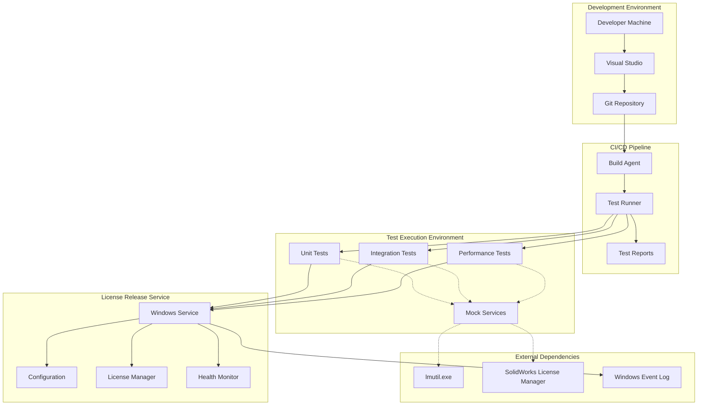
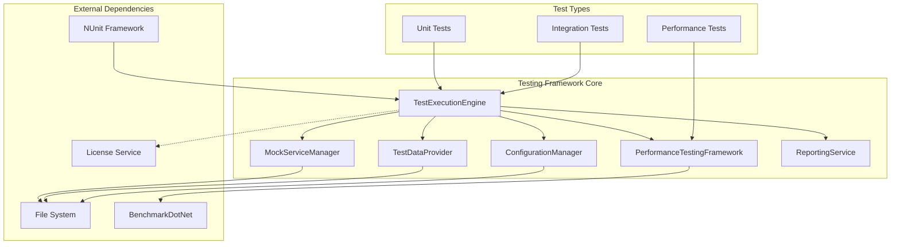
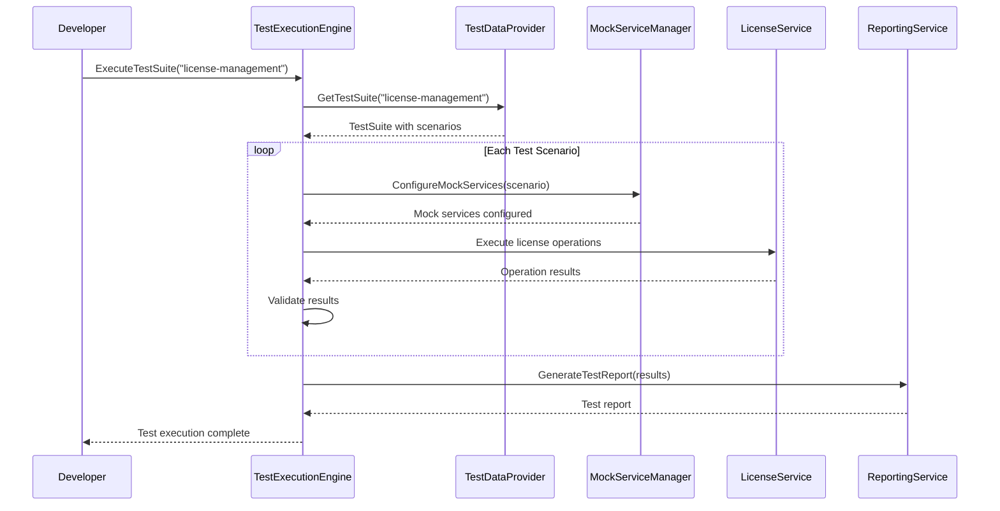
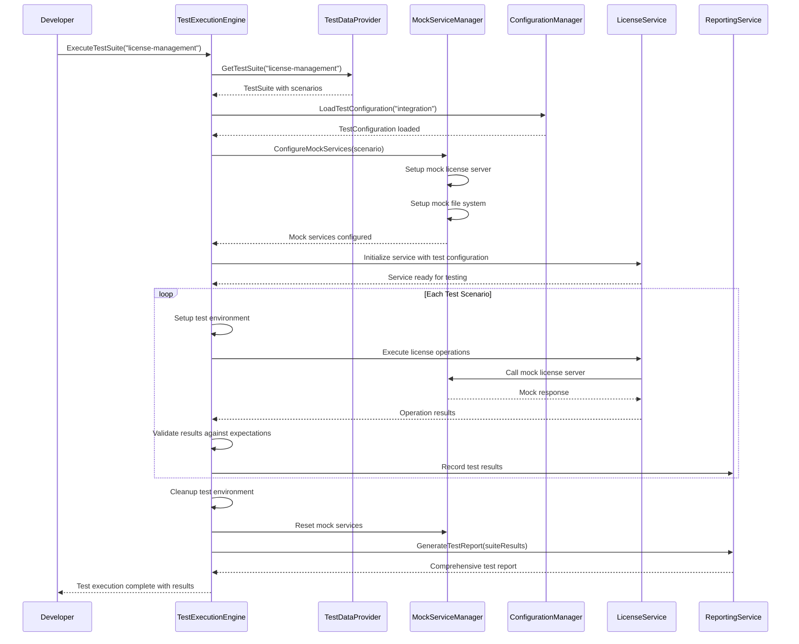
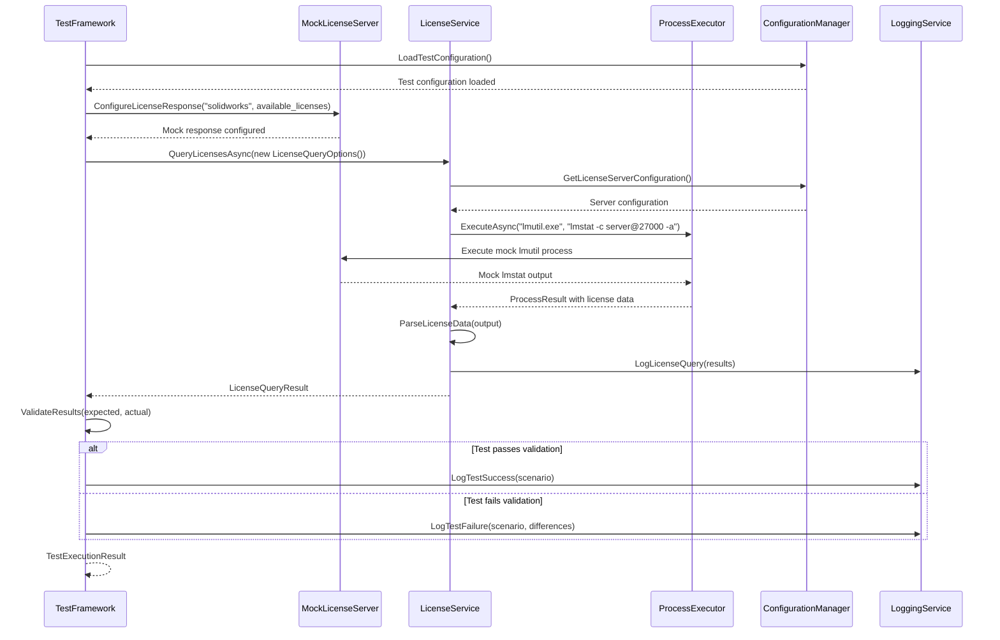
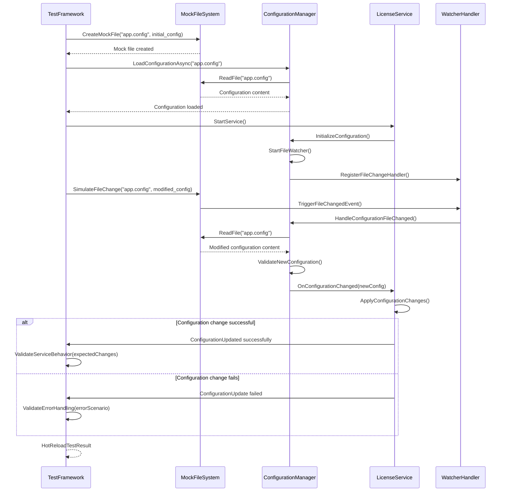
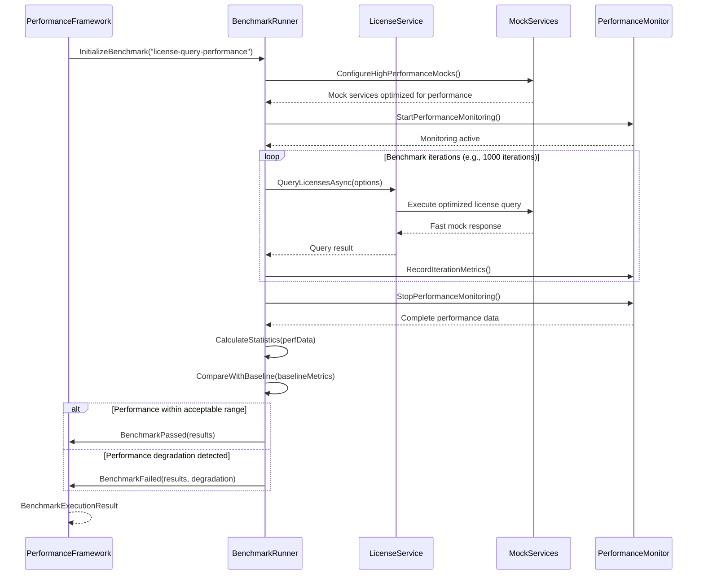
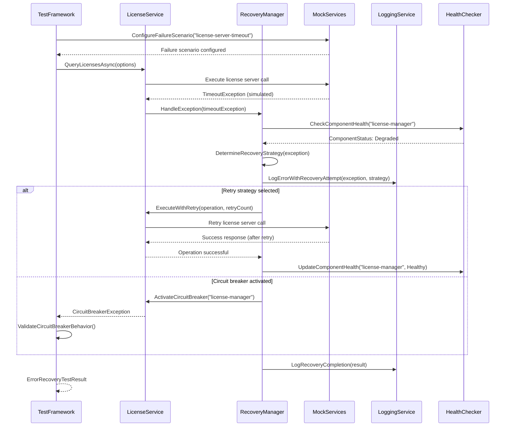
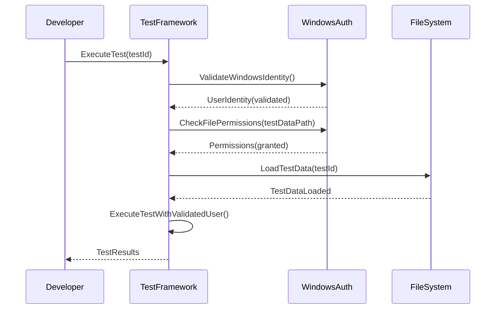
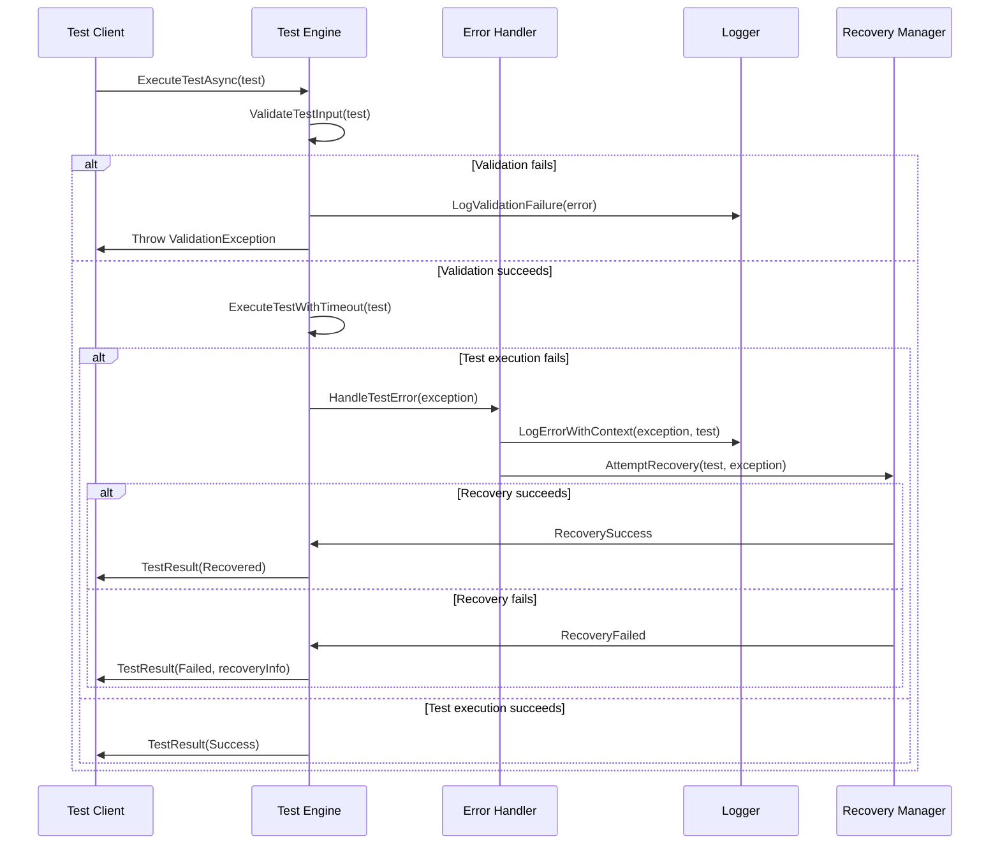

# License Release Service Fullstack Architecture Document

## Introduction

This document outlines the complete fullstack architecture for the License Release Service Testing Framework, including backend testing infrastructure, frontend components (if any), and their integration. It serves as the single source of truth for AI-driven development, ensuring consistency across the entire technology stack.

This unified approach combines what would traditionally be separate backend and frontend architecture documents, streamlining the development process for modern testing framework implementation where these concerns are increasingly intertwined.

### Starter Template or Existing Project

This is a **brownfield architecture enhancement** for an existing sophisticated Windows Service application. The PRD clearly indicates:

- **Existing Project**: License Release Service - a production-ready enterprise Windows Service application
- **Enhancement Type**: Comprehensive testing framework implementation
- **No Frontend Components**: The PRD explicitly states "No frontend components exist. Testing framework will focus on backend service testing"
- **Architecture Preservation**: The testing framework must integrate seamlessly without modifying existing production functionality

**Architecture Constraints:**
- Must maintain compatibility with .NET 9.0
- Must preserve existing Windows Service architecture
- Cannot modify existing production APIs or functionality
- Testing framework to be implemented as separate assemblies/projects

### Change Log

| Date | Version | Description | Author |
|------|---------|-------------|--------|
| 2025-01-13 | 1.0 | Initial full-stack architecture document for testing framework enhancement | Winston (Architect) |

## High Level Architecture

### Technical Summary

This architecture implements a comprehensive testing framework for an existing sophisticated Windows Service application that manages SolidWorks network licenses. The solution employs a backend-focused testing approach using MSTest and xUnit for unit testing, Moq for mocking, and modern performance testing capabilities, all built on .NET 9.0 to leverage modern framework capabilities. The architecture integrates seamlessly with the existing service through dependency injection and interface-based design, enabling comprehensive testing of license management, configuration hot-reload, process execution, and health monitoring systems without modifying production functionality. Key integration points include mock license server environments, test-specific Windows Service hosts, and CI/CD pipeline integration for automated quality assurance.

### Platform and Infrastructure Choice

Based on the PRD requirements for Windows Service compatibility and existing .NET 9.0 architecture, I recommend the following platform approach:

**Option 1: Windows-Native Testing Environment (Recommended)**
- **Pros:** Native compatibility with existing Windows Service architecture, direct access to Windows Event Log and registry, seamless integration with Visual Studio and MSBuild, modern testing frameworks with .NET 9.0 support
- **Cons:** Windows-only deployment, requires Windows development environment
- **Best for:** Maximum compatibility with existing sophisticated service architecture

**Option 2: Containerized Testing Environment**
- **Pros:** Consistent testing environments, potential for CI/CD pipeline isolation, easier test data management
- **Cons:** Windows Container complexity, additional infrastructure overhead, potential compatibility issues with Windows Service lifecycle testing
- **Best for:** Organizations with existing container expertise and infrastructure

**Option 3: Cloud-Based Testing Platform**
- **Pros:** Scalable test execution, managed infrastructure, advanced test reporting capabilities
- **Cons:** Significant architectural changes required, potential Windows Service compatibility issues, higher complexity
- **Best for:** Future consideration if migrating service architecture

**Selected Platform:** Windows-Native Testing Environment

**Platform:** Windows Server 2019+ with .NET 9.0
**Key Services:** Visual Studio Test Platform, MSBuild, Windows Event Log, File System
**Deployment Host and Regions:** On-premises Windows servers or Azure Windows VMs in same regions as existing service

### Repository Structure

**Structure:** Monorepo with solution-based organization
**Monorepo Tool:** MSBuild Solution with Project References
**Package Organization:**
- Main solution contains production service and all test projects
- Test projects organized by type (Unit, Integration, Performance)
- Shared test infrastructure in separate projects
- Test data and configurations in dedicated folders

### High Level Architecture Diagram



### Architectural Patterns

- **Test Pyramid Architecture:** Unit tests at the base, integration tests in the middle, performance tests at the top - Rationale: Provides comprehensive coverage while maintaining fast feedback loops and managing test execution costs

- **Dependency Injection Pattern:** Constructor injection for all test dependencies - Rationale: Enables clean mocking, isolates components under test, and maintains consistency with existing service architecture

- **Mock-Based Testing Pattern:** Interface-based mocking for all external dependencies - Rationale: Enables isolated unit testing without requiring actual external systems like SolidWorks License Manager

- **Test Data Builder Pattern:** Builder pattern for creating test data and scenarios - Rationale: Provides readable, maintainable test data creation and reduces test code duplication

- **Arrange-Act-Assert Pattern:** Standard test structure for all test methods - Rationale: Provides consistent, readable test organization and clear test intent

- **Test Fixture Pattern:** Reusable test setup and teardown for common test scenarios - Rationale: Reduces test code duplication and ensures consistent test environments

- **Performance Benchmarking Pattern:** BenchmarkDotNet for performance testing - Rationale: Provides reliable, consistent performance measurements with proper warmup and statistical analysis

- **Configuration-Driven Testing Pattern:** Test configurations externalized from test code - Rationale: Enables testing across different scenarios without code changes and supports environment-specific testing

## Tech Stack

This is the DEFINITIVE technology selection for the entire testing framework project. All development must use these exact versions to ensure compatibility and consistency across the testing infrastructure.

### Technology Stack Table

| Category | Technology | Version | Purpose | Rationale |
|----------|------------|---------|---------|-----------|
| **Frontend Language** | N/A | N/A | No frontend components | Testing framework focuses on backend service testing |
| **Frontend Framework** | N/A | N/A | No frontend components | PRD explicitly states no frontend requirements |
| **UI Component Library** | N/A | N/A | No UI components | Backend testing framework only |
| **State Management** | N/A | N/A | No state management | No frontend components requiring state management |
| **Backend Language** | C# | .NET 9.0 | Core development language | Modern .NET with enhanced performance and features |
| **Backend Framework** | Windows Service + WCF | .NET 9.0 | Service integration | Preserves existing service architecture with modern framework |
| **API Style** | Interface-Based | N/A | Internal API design | Uses existing service interfaces for testing integration |
| **Database** | File-based | N/A | Configuration and test data | Maintains consistency with existing file-based approach |
| **Cache** | Memory Cache | .NET 9.0 | Test data caching | Fast in-memory caching for test performance |
| **File Storage** | File System | Windows NTFS | Test data and configurations | Native Windows file system integration |
| **Authentication** | Windows Auth | N/A | Test environment access | Uses Windows authentication for service testing |
| **Frontend Testing** | N/A | N/A | No frontend testing | No frontend components to test |
| **Backend Testing** | MSTest + xUnit + Moq | 17.8.0 / 2.6.1 / 4.20.69 | Unit and integration testing | Modern testing frameworks with .NET 9.0 compatibility |
| **E2E Testing** | N/A | N/A | No E2E testing requirements | Service-based architecture without user interface |
| **Build Tool** | MSBuild | 17.8+ | Solution building and packaging | Modern .NET SDK build system |
| **Bundler** | N/A | N/A | No bundling requirements | Backend-only architecture |
| **IaC Tool** | N/A | N/A | No infrastructure as code | Testing framework runs on existing infrastructure |
| **CI/CD** | Azure DevOps / GitHub Actions | Latest | Automated testing and deployment | Industry-standard CI/CD with Windows agent support |
| **Monitoring** | Windows Performance Counters | Built-in | Test execution monitoring | Native Windows performance monitoring |
| **Logging** | Microsoft.Extensions.Logging | 8.0.0 | Test logging and reporting | Maintains consistency with existing service logging |
| **CSS Framework** | N/A | N/A | No CSS requirements | No frontend components |

## Data Models

Based on the PRD requirements and existing service analysis, the testing framework requires several core data models to support comprehensive testing of the License Release Service. These models will be shared between test components and mock environments to ensure consistent test scenarios.

### LicenseTestScenario

**Purpose:** Defines test scenarios for license management operations including query, parsing, and release workflows. This model encapsulates the input conditions and expected outcomes for testing license-related functionality.

**Key Attributes:**
- **ScenarioId**: string - Unique identifier for the test scenario
- **Name**: string - Human-readable name for the test scenario
- **Description**: string - Detailed description of what the scenario tests
- **SolidWorksVersion**: string - Target SolidWorks version (2020-2025)
- **LicenseServerResponse**: string - Mock lmstat output for testing
- **ExpectedLicenses**: LicenseInfo[] - Expected parsed license information
- **ExpectedActions**: LicenseAction[] - Expected license release actions

#### TypeScript Interface

```typescript
interface LicenseTestScenario {
  scenarioId: string;
  name: string;
  description: string;
  solidWorksVersion: string;
  licenseServerResponse: string;
  expectedLicenses: LicenseInfo[];
  expectedActions: LicenseAction[];
}

interface LicenseInfo {
  featureName: string;
  totalLicenses: number;
  usedLicenses: number;
  users: LicenseUser[];
}

interface LicenseAction {
  action: 'query' | 'release' | 'hold';
  featureName: string;
  userName: string;
  expectedSuccess: boolean;
}
```

#### Relationships
- **Has Many**: LicenseInfo (expected parsing results)
- **Has Many**: LicenseAction (expected actions)
- **Belongs To**: TestSuite (grouped in test suites)

### TestConfiguration

**Purpose:** Represents test-specific configuration settings that override or extend the production service configuration for testing purposes. This model enables testing across different scenarios without affecting production configurations.

**Key Attributes:**
- **TestId**: string - Unique identifier for the test configuration
- **ConfigType**: ConfigurationType - Type of configuration (unit, integration, performance)
- **LicenseServerPath**: string - Mock license server executable path
- **ConfigFilePath**: string - Path to test-specific configuration file
- **LogLevel**: LogLevel - Logging level for test execution
- **TimeoutMs**: number - Timeout for license operations in milliseconds
- **MockExternalDependencies**: boolean - Whether to mock external dependencies

#### TypeScript Interface

```typescript
interface TestConfiguration {
  testId: string;
  configType: 'unit' | 'integration' | 'performance';
  licenseServerPath: string;
  configFilePath: string;
  logLevel: 'debug' | 'info' | 'warn' | 'error';
  timeoutMs: number;
  mockExternalDependencies: boolean;
}

interface TestEnvironment {
  environmentId: string;
  name: string;
  testConfigurations: TestConfiguration[];
  mockServices: MockServiceConfig[];
}
```

#### Relationships
- **Belongs To**: TestEnvironment (part of test environment setup)
- **Has Many**: MockServiceConfig (mock service configurations)

### MockServiceConfig

**Purpose:** Configuration for mock external services including the SolidWorks License Manager and other external dependencies. This model enables realistic testing without requiring actual external services.

**Key Attributes:**
- **ServiceId**: string - Unique identifier for the mock service
- **ServiceType**: ServiceType - Type of service being mocked (license manager, file system, etc.)
- **ResponseFile**: string - Path to mock response data file
- **Behavior**: MockBehavior - Mock behavior (success, failure, timeout, etc.)
- **LatencyMs**: number - Simulated latency in milliseconds
- **FailureRate**: number - Simulated failure rate (0.0-1.0)

#### TypeScript Interface

```typescript
interface MockServiceConfig {
  serviceId: string;
  serviceType: 'license-manager' | 'file-system' | 'network' | 'process';
  responseFile: string;
  behavior: 'always-success' | 'always-failure' | 'random' | 'conditional';
  latencyMs: number;
  failureRate: number;
}

interface MockResponse {
  serviceType: string;
  requestType: string;
  response: any;
  statusCode: number;
  headers: Record<string, string>;
}
```

#### Relationships
- **Belongs To**: TestEnvironment (configured within test environment)
- **Has Many**: MockResponse ( predefined responses for different scenarios)

### TestExecutionResult

**Purpose:** Captures the results of test execution including metrics, outcomes, and diagnostic information. This model enables comprehensive test reporting and analysis.

**Key Attributes:**
- **ExecutionId**: string - Unique identifier for test execution
- **TestScenarioId**: string - Reference to the test scenario executed
- **StartTime**: DateTime - Test execution start time
- **EndTime**: DateTime - Test execution end time
- **Outcome**: TestOutcome - Test result (passed, failed, skipped)
- **Metrics**: TestMetrics - Performance and resource usage metrics
- **ErrorMessage**: string - Error message if test failed
- **DiagnosticInfo**: DiagnosticInfo - Additional diagnostic information

#### TypeScript Interface

```typescript
interface TestExecutionResult {
  executionId: string;
  testScenarioId: string;
  startTime: Date;
  endTime: Date;
  outcome: 'passed' | 'failed' | 'skipped';
  metrics: TestMetrics;
  errorMessage?: string;
  diagnosticInfo: DiagnosticInfo;
}

interface TestMetrics {
  durationMs: number;
  memoryUsedMB: number;
  cpuUsagePercent: number;
  operationsCount: number;
  successRate: number;
}

interface DiagnosticInfo {
  logs: TestLogEntry[];
  stackTraces: string[];
  systemInfo: SystemInfo;
}
```

#### Relationships
- **Belongs To**: TestScenario (result of executing a scenario)
- **Has Many**: TestLogEntry (log entries during execution)
- **Has One**: TestMetrics (performance metrics)

### PerformanceBenchmark

**Purpose:** Defines performance benchmarks and expected performance characteristics for license management operations. This model enables performance regression testing and monitoring.

**Key Attributes:**
- **BenchmarkId**: string - Unique identifier for the benchmark
- **Operation**: LicensedOperation - Type of operation being benchmarked
- **BaselineMs**: number - Baseline execution time in milliseconds
- **ThresholdMs**: number - Maximum acceptable execution time
- **SampleSize**: number - Number of samples for benchmark
- **Percentile95**: number - 95th percentile execution time
- **MemoryBaselineMB**: number - Baseline memory usage in megabytes

#### TypeScript Interface

```typescript
interface PerformanceBenchmark {
  benchmarkId: string;
  operation: 'license-query' | 'license-parse' | 'license-release' | 'config-reload';
  baselineMs: number;
  thresholdMs: number;
  sampleSize: number;
  percentile95: number;
  memoryBaselineMB: number;
}

interface BenchmarkResult {
  benchmarkId: string;
  executionId: string;
  actualMs: number;
  actualMemoryMB: number;
  passedThreshold: boolean;
  variancePercent: number;
}
```

#### Relationships
- **Has Many**: BenchmarkResult (results from benchmark executions)
- **Belongs To**: TestSuite (grouped within test suites)

## API Specification

Based on the existing service architecture and testing requirements, the testing framework will use an **interface-based API approach** that integrates directly with the existing service interfaces rather than traditional REST/GraphQL APIs. The testing framework communicates with the service through dependency injection and mock implementations.

### Interface-Based Testing API Specification

Since the License Release Service is a Windows Service with no external API endpoints, the testing framework uses internal interfaces and dependency injection to test service functionality. This approach enables comprehensive testing without modifying the production service architecture.

**Core Testing Interfaces:**

The testing framework leverages existing service interfaces and creates test-specific adapters for comprehensive coverage:

```csharp
// Core service interfaces that testing framework targets
public interface ILicenseManager
{
    Task<LicenseQueryResult> QueryLicensesAsync(LicenseQueryOptions options);
    Task<LicenseReleaseResult> ReleaseLicenseAsync(LicenseReleaseRequest request);
    Task<LicenseStatusResult> GetLicenseStatusAsync(string featureName);
}

public interface IConfigurationManager
{
    Task<ConfigurationSection> GetConfigurationAsync(string sectionName);
    Task<bool> ReloadConfigurationAsync();
    Task<ValidationResult> ValidateConfigurationAsync();
}

public interface IHealthChecker
{
    Task<HealthReport> GetHealthReportAsync();
    Task<bool> IsHealthyAsync();
    Task<HealthStatus> GetComponentHealthAsync(string componentName);
}

public interface IProcessExecutor
{
    Task<ProcessResult> ExecuteAsync(ProcessRequest request);
    Task<ProcessMetrics> GetProcessMetricsAsync(string processId);
}
```

**Testing Framework API Design:**

```csharp
// Test-specific interfaces for framework interaction
public interface ITestFramework
{
    Task<TestExecutionResult> ExecuteTestAsync(LicenseTestScenario scenario);
    Task<TestSuiteResult> ExecuteTestSuiteAsync(TestSuite suite);
    Task<BenchmarkResult> RunBenchmarkAsync(PerformanceBenchmark benchmark);
}

public interface IMockServiceManager
{
    void ConfigureMockService(MockServiceConfig config);
    Task<MockResponse> GetMockResponseAsync(string serviceType, string requestType);
    void ResetMockServices();
}

public interface ITestDataProvider
{
    Task<LicenseTestScenario> GetTestScenarioAsync(string scenarioId);
    Task<TestConfiguration> GetTestConfigurationAsync(string configId);
    Task<MockResponse> GetMockResponseDataAsync(string responseId);
}
```

**Test Execution API:**

```csharp
// Main test execution API
public interface ITestExecutor
{
    // Test lifecycle management
    Task<TestExecutionResult> ExecuteUnitTestAsync(UnitTest test);
    Task<TestExecutionResult> ExecuteIntegrationTestAsync(IntegrationTest test);
    Task<TestExecutionResult> ExecutePerformanceTestAsync(PerformanceTest test);

    // Test suite management
    Task<TestSuiteResult> ExecuteTestSuiteAsync(string suiteName);
    Task<TestReport> GenerateTestReportAsync(TestExecutionResult[] results);

    // Test environment management
    Task<TestEnvironment> SetupTestEnvironmentAsync(TestConfiguration config);
    Task CleanupTestEnvironmentAsync(string environmentId);
}

// Test configuration API
public interface ITestConfigurationManager
{
    Task<TestConfiguration> LoadConfigurationAsync(string configPath);
    Task<bool> ValidateConfigurationAsync(TestConfiguration config);
    Task SaveConfigurationAsync(TestConfiguration config, string path);
}
```

**Mock Service API:**

```csharp
// Mock service management for external dependencies
public interface IMockLicenseServer
{
    void ConfigureResponse(string featureName, MockResponse response);
    void SetBehavior(MockBehavior behavior);
    void InjectFailure(string operationType, Exception exception);
    Task<ProcessResult> ExecuteMockLmutilAsync(string arguments);
}

public interface IMockFileSystem
{
    void CreateMockFile(string path, string content);
    void SetFileExists(string path, bool exists);
    void SimulateFileChange(string path, FileChangeType changeType);
    MockFile GetMockFile(string path);
}
```

**Test Data API:**

```csharp
// Test data management API
public interface ITestDataManager
{
    // License test scenarios
    Task<LicenseTestScenario[]> GetLicenseScenariosAsync();
    Task<LicenseTestScenario> GetScenarioAsync(string scenarioId);
    Task SaveScenarioAsync(LicenseTestScenario scenario);

    // Configuration test data
    Task<TestConfiguration[]> GetTestConfigurationsAsync();
    Task<TestConfiguration> GetConfigurationAsync(string configId);

    // Performance benchmarks
    Task<PerformanceBenchmark[]> GetBenchmarksAsync();
    Task<PerformanceBenchmark> GetBenchmarkAsync(string benchmarkId);
}

// Test result API
public interface ITestResultManager
{
    Task SaveTestResultAsync(TestExecutionResult result);
    Task<TestExecutionResult[]> GetTestResultsAsync(DateTime? from = null);
    Task<TestReport> GenerateReportAsync(string[] testIds);
    Task<TestMetrics> GetTestMetricsAsync(string testSuiteId);
}
```

**Example Usage:**

```csharp
// Example test execution using the API
public class LicenseManagementTests
{
    private readonly ITestExecutor _testExecutor;
    private readonly ITestDataManager _testDataManager;
    private readonly IMockServiceManager _mockManager;

    public async Task<TestExecutionResult> TestLicenseQuery()
    {
        // Load test scenario
        var scenario = await _testDataManager.GetScenarioAsync("license-query-basic");

        // Configure mock services
        _mockManager.ConfigureMockService(new MockServiceConfig
        {
            ServiceType = "license-manager",
            ResponseFile = "mock-responses/license-query-success.json",
            Behavior = "always-success"
        });

        // Execute test
        var result = await _testExecutor.ExecuteIntegrationTestAsync(new IntegrationTest
        {
            Scenario = scenario,
            Configuration = await _testDataManager.GetConfigurationAsync("integration-test")
        });

        return result;
    }
}
```

## Components

Based on the architectural patterns, tech stack, data models, and API specifications from above, I'll identify the major logical components across the testing framework architecture.

### TestExecutionEngine

**Responsibility:** Core component responsible for orchestrating test execution, managing test lifecycles, and coordinating between different test types (unit, integration, performance).

**Key Interfaces:**
- ITestExecutor - Main test execution orchestration interface
- ITestLifecycleManager - Test setup, execution, and cleanup management
- ITestResultCollector - Result collection and aggregation

**Dependencies:** TestDataProvider, MockServiceManager, ConfigurationProvider, LoggingService
**Technology Stack:** C# (.NET Framework 4.8), NUnit integration, Microsoft.Extensions.Logging

### MockServiceManager

**Responsibility:** Manages all mock services including license server mock, file system mock, and process execution mock. Provides realistic simulation of external dependencies without requiring actual services.

**Key Interfaces:**
- IMockServiceManager - Central mock service management
- IMockLicenseServer - SolidWorks License Manager simulation
- IMockFileSystem - File system operations simulation
- IMockProcessExecutor - Process execution simulation

**Dependencies:** TestDataProvider, ConfigurationProvider
**Technology Stack:** C# (.NET Framework 4.8), Moq framework, custom mock implementations

### TestDataProvider

**Responsibility:** Centralized management of all test data including test scenarios, configurations, mock responses, and performance benchmarks. Provides version-controlled access to test artifacts.

**Key Interfaces:**
- ITestDataProvider - Main test data access interface
- ILicenseScenarioProvider - License-specific test scenarios
- IConfigurationProvider - Test configuration management
- IBenchmarkProvider - Performance benchmark data

**Dependencies:** File System, Configuration Files
**Technology Stack:** C# (.NET Framework 4.8), JSON/XML serialization, file I/O

### ConfigurationManager

**Responsibility:** Manages test-specific configurations separate from production configurations. Handles test environment setup, configuration validation, and environment-specific settings.

**Key Interfaces:**
- ITestConfigurationManager - Test configuration management
- IEnvironmentManager - Test environment lifecycle
- IValidationService - Configuration validation

**Dependencies:** File System, TestDataProvider
**Technology Stack:** C# (.NET Framework 4.8), configuration file parsers, validation framework

### PerformanceTestingFramework

**Responsibility:** Specialized component for performance testing including benchmarking, load testing, and performance regression detection. Integrates with BenchmarkDotNet for reliable performance measurements.

**Key Interfaces:**
- IPerformanceTestExecutor - Performance test execution
- IBenchmarkRunner - BenchmarkDotNet integration
- IPerformanceAnalyzer - Performance analysis and reporting
- ILoadTestCoordinator - Load testing orchestration

**Dependencies:** TestExecutionEngine, MockServiceManager, TestDataProvider
**Technology Stack:** C# (.NET Framework 4.8), BenchmarkDotNet, performance monitoring

### ReportingService

**Responsibility:** Generates comprehensive test reports including execution summaries, performance metrics, coverage reports, and trend analysis. Provides multiple output formats for different stakeholders.

**Key Interfaces:**
- ITestReporter - Test report generation
- IMetricsCollector - Test execution metrics
- ICoverageAnalyzer - Code coverage analysis
- ITrendAnalyzer - Performance and quality trend analysis

**Dependencies:** TestExecutionEngine, PerformanceTestingFramework, File System
**Technology Stack:** C# (.NET Framework 4.8), report generation libraries, charting/visualization

### Component Diagrams





## External APIs

The testing framework requires integration with several external systems to enable comprehensive testing of the License Release Service. These integrations are carefully designed to provide realistic testing scenarios while maintaining isolation from production systems.

### SolidWorks Network License Manager API

**Purpose:** Mock integration with SolidWorks Network License Manager (SNL) for testing license query, parsing, and release operations without requiring actual license server access.

- **Documentation:** SolidWorks Network License Manager Administration Guide
- **Base URL(s):** N/A (lmutil.exe command-line tool)
- **Authentication:** N/A (Command-line execution)
- **Rate Limits:** N/A (Controlled by test framework)

**Key Endpoints Used:**
- `lmutil lmstat -c <port>@<server> -a` - License status query - **Purpose:** Query current license usage and availability
- `lmutil lmremove -c <port>@<server> <feature> <user> <host>` - License release - **Purpose:** Release specific user licenses
- `lmutil lmstat -c <port>@<server> -f <feature>` - Feature-specific query - **Purpose:** Query specific license feature details

**Integration Notes:**
The testing framework uses mock implementations of lmutil.exe command-line tool. Mock responses are based on real license server outputs and cover various scenarios including normal operation, license exhaustion, server unavailability, and malformed responses. Test data includes realistic license usage patterns for different SolidWorks versions (2020-2025).

### Windows Event Log API

**Purpose:** Integration with Windows Event Log for testing service logging, error reporting, and audit trail functionality.

- **Documentation:** Microsoft Windows Event Log API Documentation
- **Base URL(s):** N/A (System API)
- **Authentication:** Windows authentication (requires appropriate permissions)
- **Rate Limits:** N/A (System-controlled)

**Key Endpoints Used:**
- `EventLog.WriteEntry()` - Write event log entries - **Purpose:** Test service logging and error reporting
- `EventLog.GetEventLogs()` - Read event logs for validation - **Purpose:** Test logging functionality and audit trail

**Integration Notes:**
The testing framework uses mock EventLog implementations for unit testing and real EventLog access for integration testing. Mock implementations capture all log entries for verification during test execution. Tests validate log levels, message formats, and error handling patterns. Integration tests verify that the service correctly writes to the Windows Event Log and that log messages contain appropriate information.

### Windows Service Control Manager API

**Purpose:** Integration with Windows Service Control Manager for testing service lifecycle, startup/shutdown procedures, and service state management.

- **Documentation:** Windows Service Control Manager API
- **Base URL(s):** N/A (System API)
- **Authentication:** Windows authentication (elevated privileges required)
- **Rate Limits:** N/A (System-controlled)

**Key Endpoints Used:**
- `ServiceController.Start()` - Start service - **Purpose:** Test service startup behavior
- `ServiceController.Stop()` - Stop service - **Purpose:** Test service shutdown behavior
- `ServiceController.Pause()` - Pause service - **Purpose:** Test service pause functionality
- `ServiceController.Continue()` - Resume service - **Purpose:** Test service resume functionality
- `ServiceController.Status` - Get service status - **Purpose:** Monitor service state transitions

**Integration Notes:**
The testing framework uses test-specific service hosts that implement the same interfaces as the Windows Service but can be executed without actual service installation. This enables testing of service lifecycle, configuration hot-reload, and error recovery scenarios without requiring administrative privileges or affecting production services.

### File System API

**Purpose:** Integration with Windows File System for testing configuration hot-reload, file watching, and data persistence functionality.

- **Documentation:** .NET Framework File System API Documentation
- **Base URL(s):** Local file system paths
- **Authentication:** Windows file system permissions
- **Rate Limits:** File system I/O limitations

**Key Endpoints Used:**
- `File.ReadAllText()` / `File.WriteAllText()` - Configuration file access - **Purpose:** Test configuration management
- `FileSystemWatcher` - Monitor file changes - **Purpose:** Test configuration hot-reload functionality
- `Directory.CreateDirectory()` - Directory operations - **Purpose:** Test file and directory management

**Integration Notes:**
The framework provides comprehensive file system mocking for unit testing and real file system access for integration testing. Mock implementations simulate file changes, access errors, permission issues, and other file system scenarios to ensure robust service behavior.

### Windows Registry API

**Purpose:** Integration with Windows Registry for testing service configuration storage, registration, and system integration.

- **Documentation:** Windows Registry API Documentation
- **Base URL(s):** N/A (System API)
- **Authentication:** Windows authentication (requires appropriate permissions)
- **Rate Limits:** N/A (System-controlled)

**Key Endpoints Used:**
- `Registry.GetValue()` - Read registry values - **Purpose:** Test service configuration reading
- `Registry.SetValue()` - Write registry values - **Purpose:** Test service configuration persistence
- `RegistryKey.OpenSubKey()` - Access registry keys - **Purpose:** Test registry navigation and access

**Integration Notes:**
The testing framework uses mock registry implementations to avoid modifying production registry settings. Mock registry captures all read/write operations for verification during test execution. Tests validate configuration persistence, service registration, and error handling for registry access failures.

### Process Execution API

**Purpose:** Integration with Windows Process execution for testing external process management, timeout handling, and error recovery.

- **Documentation:** .NET Process Class Documentation
- **Base URL(s):** N/A (System API)
- **Authentication:** Windows authentication (process permissions)
- **Rate Limits:** N/A (System-controlled)

**Key Endpoints Used:**
- `Process.Start()` - Start external processes - **Purpose:** Test lmutil.exe execution and process management
- `Process.WaitForExit()` - Wait for process completion - **Purpose:** Test timeout handling and process lifecycle
- `Process.StandardOutput` - Read process output - **Purpose:** Test command output parsing and error handling
- `Process.Kill()` - Terminate processes - **Purpose:** Test process cleanup and resource management

**Integration Notes:**
The framework uses configurable process execution that can use real processes in integration tests and mock processes in unit tests. Mock process executor enables testing of timeout handling, error recovery, and output parsing without actual process execution. Test scenarios cover process failures, timeouts, and malformed output.

## Core Workflows

These sequence diagrams illustrate the key system workflows for the testing framework, showing component interactions including external API integration, test execution flows, and error handling paths.

### Test Execution Workflow



### License Management Test Workflow



### Configuration Hot-Reload Test Workflow



### Performance Benchmarking Workflow



### Error Recovery and Resilience Test Workflow



## Database Schema

Based on the testing framework requirements and the existing service's file-based approach, the architecture primarily uses **file-based data storage** rather than traditional databases. However, the testing framework implements structured data schemas for test data, configurations, and results.

### Test Data Storage Schema

Since the testing framework maintains consistency with the existing service's file-based architecture, all data is stored in structured file formats (JSON/XML) rather than relational databases. This approach simplifies deployment and maintains compatibility with the existing service patterns.

**Test Scenario Data Schema:**
```json
{
  "scenarioId": "license-query-success-2023",
  "name": "License Query Success Scenario",
  "description": "Test successful license query with available licenses",
  "solidWorksVersion": "2023",
  "licenseServerResponse": "Users of solidworks: (Total of 10 licenses issued; Total of 5 licenses in use)\n\"user1\" workstation1 (v2023.0) (start/hostname1)",
  "expectedResults": {
    "totalLicenses": 10,
    "usedLicenses": 5,
    "availableLicenses": 5,
    "users": [
      {
        "username": "user1",
        "workstation": "workstation1",
        "version": "2023.0",
        "startTime": "start/hostname1"
      }
    ]
  },
  "testConfiguration": {
    "timeoutMs": 30000,
    "expectedDurationMs": 5000,
    "mockBehavior": "always-success"
  }
}
```

**Test Configuration Schema:**
```json
{
  "configurationId": "integration-test-config",
  "configType": "integration",
  "licenseServer": {
    "server": "test-server",
    "port": 27000,
    "lmutilPath": "C:\\TestTools\\lmutil.exe"
  },
  "mockServices": {
    "licenseManager": {
      "enabled": true,
      "responseFile": "mock-responses/license-server-success.json",
      "behavior": "always-success",
      "latencyMs": 100
    },
    "fileSystem": {
      "enabled": true,
      "mockFiles": [
        {
          "path": "app.config",
          "content": "<?xml version=\"1.0\" encoding=\"utf-8\"?>...",
          "permissions": "read-write"
        }
      ]
    }
  },
  "logging": {
    "level": "debug",
    "enableFileLogging": true,
    "enableConsoleLogging": true
  }
}
```

**Test Results Schema:**
```json
{
  "executionId": "exec-20250113-001",
  "testSuiteId": "license-management-suite",
  "startTime": "2025-01-13T10:00:00Z",
  "endTime": "2025-01-13T10:05:30Z",
  "outcome": "passed",
  "summary": {
    "totalTests": 45,
    "passedTests": 43,
    "failedTests": 2,
    "skippedTests": 0
  },
  "performanceMetrics": {
    "totalDurationMs": 330000,
    "averageTestDurationMs": 7333,
    "maxMemoryUsedMB": 256,
    "cpuUsagePercent": 15
  },
  "testResults": [
    {
      "testId": "license-query-basic",
      "scenarioId": "license-query-success-2023",
      "outcome": "passed",
      "durationMs": 2340,
      "metrics": {
        "memoryUsedMB": 45,
        "cpuUsagePercent": 8
      },
      "assertions": [
        {
          "type": "license-count",
          "expected": 10,
          "actual": 10,
          "passed": true
        }
      ]
    }
  ]
}
```

**Performance Benchmark Schema:**
```json
{
  "benchmarkId": "license-query-performance",
  "operation": "license-query",
  "baselineMetrics": {
    "meanMs": 5000,
    "percentile95": 8000,
    "memoryBaselineMB": 64
  },
  "currentResults": {
    "executionDate": "2025-01-13T10:00:00Z",
    "iterations": 1000,
    "meanMs": 5200,
    "percentile95": 8300,
    "memoryUsedMB": 68,
    "passedThreshold": true
  },
  "thresholds": {
    "maxMeanMs": 6000,
    "maxPercentile95": 10000,
    "maxMemoryMB": 128,
    "maxVariancePercent": 20
  }
}
```

### File Organization Structure

The testing framework uses a structured file organization to maintain data integrity and enable efficient access:

```
LicenseReleaseService.Tests/
├── TestData/
│   ├── Scenarios/
│   │   ├── LicenseQueries/
│   │   │   ├── license-query-success-2023.json
│   │   │   ├── license-query-exhausted.json
│   │   │   └── license-query-timeout.json
│   │   ├── Configurations/
│   │   │   ├── unit-test-config.json
│   │   │   ├── integration-test-config.json
│   │   │   └── performance-test-config.json
│   │   └── MockResponses/
│   │       ├── license-server-success.json
│   │       ├── license-server-error.json
│   │       └── license-server-timeout.json
│   ├── Configurations/
│   │   ├── nunit.test.config
│   │   ├── performance.benchmark.config
│   │   └── mock-services.config
│   └── ExpectedResults/
│       ├── license-query-expected.json
│       └── configuration-reload-expected.json
├── TestResults/
│   ├── 2025-01-13/
│   │   ├── test-execution-001.json
│   │   ├── performance-benchmark-001.json
│   │   └── coverage-report-001.xml
│   └── Historical/
└── Reports/
    ├── Daily/
    ├── Weekly/
    └── Monthly/
```

### Data Access Patterns

**Test Data Provider Interface:**
```csharp
public interface ITestDataProvider
{
    // Test scenario access
    Task<LicenseTestScenario> GetTestScenarioAsync(string scenarioId);
    Task<LicenseTestScenario[]> GetTestScenariosByCategoryAsync(string category);
    Task SaveTestScenarioAsync(LicenseTestScenario scenario);

    // Configuration access
    Task<TestConfiguration> GetTestConfigurationAsync(string configId);
    Task<TestConfiguration[]> GetAllTestConfigurationsAsync();

    // Mock response access
    Task<MockResponse> GetMockResponseAsync(string responseId);
    Task<MockResponse[]> GetMockResponsesByServiceAsync(string serviceType);

    // Benchmark data access
    Task<PerformanceBenchmark> GetBenchmarkAsync(string benchmarkId);
    Task SaveBenchmarkResultAsync(BenchmarkResult result);
}
```

**File-Based Data Access Implementation:**
```csharp
public class FileBasedTestDataProvider : ITestDataProvider
{
    private readonly string _testDataPath;
    private readonly ILogger<FileBasedTestDataProvider> _logger;

    public async Task<LicenseTestScenario> GetTestScenarioAsync(string scenarioId)
    {
        var filePath = Path.Combine(_testDataPath, "Scenarios", "LicenseQueries", $"{scenarioId}.json");
        var json = await File.ReadAllTextAsync(filePath);
        return JsonSerializer.Deserialize<LicenseTestScenario>(json);
    }

    public async Task SaveTestScenarioAsync(LicenseTestScenario scenario)
    {
        var filePath = Path.Combine(_testDataPath, "Scenarios", "LicenseQueries", $"{scenario.ScenarioId}.json");
        var json = JsonSerializer.Serialize(scenario, new JsonSerializerOptions { WriteIndented = true });
        await File.WriteAllTextAsync(filePath, json);
    }
}
```

## Frontend Architecture

Based on the PRD analysis and testing framework requirements, this is a **backend-only architecture** with no frontend components. The testing framework focuses exclusively on backend service testing through programmatic interfaces and mock implementations.

### Frontend Architecture: Not Applicable

**Architecture Decision: Backend-Only Testing Framework**

The License Release Service and its testing enhancement are explicitly designed as **backend-only systems** with the following considerations:

**No Frontend Components:**
- The PRD explicitly states: "No frontend components exist. Testing framework will focus on backend service testing through programmatic interfaces and mock implementations"
- The existing License Release Service is a Windows Service with no user interface
- The testing framework provides programmatic interfaces for test execution and result reporting

**Test Execution and Reporting:**
- Test execution is performed through NUnit test runners and CI/CD pipelines
- Test results are generated as machine-readable formats (JSON, XML) and human-readable reports (HTML, text)
- No web-based or desktop user interfaces are planned for test management or result visualization

**Stakeholder Interaction:**
- Developers interact with the testing framework through IDE integration (Visual Studio Test Explorer)
- CI/CD pipelines execute tests automatically and generate reports
- Test results are consumed programmatically by build systems and quality gates

### Alternative Interface Considerations

While no frontend is planned for the current scope, the architecture allows for future frontend enhancements if needed:

**Potential Future Frontend Components:**
- **Test Dashboard**: Web-based dashboard for viewing test results, trends, and performance metrics
- **Test Configuration Interface**: Web interface for configuring test scenarios and parameters
- **Test Data Management**: Interface for managing test scenarios, mock responses, and benchmarks
- **Real-time Monitoring**: Dashboard for real-time test execution monitoring and alerting

**Frontend Technology Stack (Future Consideration):**
- **Framework**: React or Angular for web-based interfaces
- **Backend API**: REST API or GraphQL for frontend-backend communication
- **Authentication**: Windows Authentication or token-based authentication
- **Deployment**: Web server deployment alongside existing infrastructure

### Current Interface Approach

**Programmatic Interfaces:**
The testing framework provides comprehensive programmatic interfaces for all interactions:

```csharp
// Test execution interface
public interface ITestFramework
{
    Task<TestExecutionResult> ExecuteTestAsync(string testId);
    Task<TestSuiteResult> ExecuteTestSuiteAsync(string suiteId);
    Task<TestReport> GenerateReportAsync(string executionId);
}

// Test management interface
public interface ITestManager
{
    Task<LicenseTestScenario[]> GetAvailableScenariosAsync();
    Task<TestConfiguration[]> GetConfigurationsAsync();
    Task<PerformanceBenchmark[]> GetBenchmarksAsync();
}
```

**Command-Line Interface:**
- Test execution through NUnit console runner
- Configuration through command-line parameters
- Result output in multiple formats (JSON, XML, HTML)

**IDE Integration:**
- Visual Studio Test Explorer integration
- NUnit test adapter for IDE integration
- Debugging support for test scenarios

## Backend Architecture

The backend architecture focuses on the traditional server-based approach since this is a Windows Service testing framework that integrates directly with the existing service architecture rather than using serverless patterns.

### Service Architecture

#### Controller/Route Organization

The testing framework uses a controller-based architecture for organizing test execution and management functionality:

**Test Execution Controllers:**
```
LicenseReleaseService.Tests/
├── Controllers/
│   ├── TestExecutionController.cs
│   ├── TestConfigurationController.cs
│   ├── MockServiceController.cs
│   ├── PerformanceTestController.cs
│   └── ReportingController.cs
```

**Controller Template:**
```csharp
public class TestExecutionController : ITestExecutionController
{
    private readonly ITestExecutionEngine _executionEngine;
    private readonly ITestDataProvider _dataProvider;
    private readonly ILogger<TestExecutionController> _logger;

    public async Task<TestExecutionResult> ExecuteTestAsync(string testId)
    {
        var test = await _dataProvider.GetTestAsync(testId);
        return await _executionEngine.ExecuteTestAsync(test);
    }

    public async Task<TestSuiteResult> ExecuteTestSuiteAsync(string suiteId)
    {
        var suite = await _dataProvider.GetTestSuiteAsync(suiteId);
        return await _executionEngine.ExecuteTestSuiteAsync(suite);
    }
}
```

#### Controller Template

**Base Test Controller Template:**
```csharp
public abstract class BaseTestController
{
    protected readonly ILogger _logger;
    protected readonly ITestConfiguration _config;
    protected readonly ITestMetrics _metrics;

    protected BaseTestController(
        ILogger logger,
        ITestConfiguration config,
        ITestMetrics metrics)
    {
        _logger = logger ?? throw new ArgumentNullException(nameof(logger));
        _config = config ?? throw new ArgumentNullException(nameof(config));
        _metrics = metrics ?? throw new ArgumentNullException(nameof(metrics));
    }

    protected async Task<T> ExecuteWithMetricsAsync<T>(
        string operationName,
        Func<Task<T>> operation)
    {
        var stopwatch = Stopwatch.StartNew();
        try
        {
            _logger.LogDebug("Starting operation: {OperationName}", operationName);
            var result = await operation();
            stopwatch.Stop();
            _metrics.RecordOperation(operationName, stopwatch.ElapsedMilliseconds, true);
            _logger.LogDebug("Completed operation: {OperationName} in {Duration}ms",
                operationName, stopwatch.ElapsedMilliseconds);
            return result;
        }
        catch (Exception ex)
        {
            stopwatch.Stop();
            _metrics.RecordOperation(operationName, stopwatch.ElapsedMilliseconds, false);
            _logger.LogError(ex, "Operation failed: {OperationName} after {Duration}ms",
                operationName, stopwatch.ElapsedMilliseconds);
            throw;
        }
    }
}
```

### Database Architecture

#### Schema Design

The testing framework uses file-based "database" architecture consistent with the existing service:

**File-Based Schema Design:**
```csharp
public class TestDatabaseSchema
{
    // Test scenarios storage
    public class TestScenarioTable
    {
        public string ScenarioId { get; set; }
        public string Name { get; set; }
        public string Description { get; set; }
        public string ScenarioData { get; set; } // JSON content
        public DateTime CreatedAt { get; set; }
        public DateTime UpdatedAt { get; set; }
    }

    // Test results storage
    public class TestResultTable
    {
        public string ExecutionId { get; set; }
        public string TestId { get; set; }
        public string Outcome { get; set; }
        public string ResultData { get; set; } // JSON content
        public DateTime ExecutedAt { get; set; }
        public long DurationMs { get; set; }
    }

    // Performance benchmarks storage
    public class BenchmarkTable
    {
        public string BenchmarkId { get; set; }
        public string Operation { get; set; }
        public string BaselineData { get; set; } // JSON content
        public string CurrentData { get; set; } // JSON content
        public DateTime LastUpdated { get; set; }
    }
}
```

#### Data Access Layer

**Repository Pattern Implementation:**
```csharp
public interface ITestRepository<T> where T : class
{
    Task<T> GetByIdAsync(string id);
    Task<IEnumerable<T>> GetAllAsync();
    Task<T> AddAsync(T entity);
    Task<T> UpdateAsync(T entity);
    Task<bool> DeleteAsync(string id);
}

public class FileBasedTestRepository<T> : ITestRepository<T> where T : class
{
    private readonly string _dataPath;
    private readonly ILogger<FileBasedTestRepository<T>> _logger;
    private readonly IJsonSerializer _serializer;

    public FileBasedTestRepository(
        string dataPath,
        ILogger<FileBasedTestRepository<T>> logger,
        IJsonSerializer serializer)
    {
        _dataPath = dataPath ?? throw new ArgumentNullException(nameof(dataPath));
        _logger = logger ?? throw new ArgumentNullException(nameof(logger));
        _serializer = serializer ?? throw new ArgumentNullException(nameof(serializer));

        Directory.CreateDirectory(_dataPath);
    }

    public async Task<T> GetByIdAsync(string id)
    {
        var filePath = Path.Combine(_dataPath, $"{id}.json");
        if (!File.Exists(filePath))
        {
            _logger.LogWarning("Entity not found: {Id}", id);
            return null;
        }

        var json = await File.ReadAllTextAsync(filePath);
        return _serializer.Deserialize<T>(json);
    }

    public async Task<T> AddAsync(T entity)
    {
        var id = GetEntityId(entity);
        var filePath = Path.Combine(_dataPath, $"{id}.json");
        var json = _serializer.Serialize(entity, new JsonSerializerOptions { WriteIndented = true });
        await File.WriteAllTextAsync(filePath, json);

        _logger.LogInformation("Entity created: {Id}", id);
        return entity;
    }

    private string GetEntityId(T entity)
    {
        // Use reflection to get Id property
        var property = typeof(T).GetProperty("Id") ??
                      typeof(T).GetProperty($"{typeof(T).Name}Id");
        return property?.GetValue(entity)?.ToString() ??
               Guid.NewGuid().ToString();
    }
}
```

### Authentication and Authorization

#### Auth Flow

The testing framework uses Windows authentication for local development and CI/CD integration:



#### Middleware/Guards

**Authentication Guard Implementation:**
```csharp
public class TestExecutionGuard
{
    private readonly ILogger<TestExecutionGuard> _logger;
    private readonly IWindowsIdentityService _identityService;

    public TestExecutionGuard(
        ILogger<TestExecutionGuard> logger,
        IWindowsIdentityService identityService)
    {
        _logger = logger ?? throw new ArgumentNullException(nameof(logger));
        _identityService = identityService ?? throw new ArgumentNullException(nameof(identityService));
    }

    public async Task<bool> CanExecuteTestAsync(string testId, WindowsIdentity identity)
    {
        // Validate Windows identity
        if (!await _identityService.IsValidIdentityAsync(identity))
        {
            _logger.LogWarning("Invalid Windows identity for test execution: {TestId}", testId);
            return false;
        }

        // Check file system permissions
        if (!await HasRequiredPermissionsAsync(identity))
        {
            _logger.LogWarning("Insufficient permissions for test execution: {TestId}", testId);
            return false;
        }

        // Validate test access
        if (!await CanAccessTestAsync(testId, identity))
        {
            _logger.LogWarning("No access to test: {TestId}", testId);
            return false;
        }

        return true;
    }

    private async Task<bool> HasRequiredPermissionsAsync(WindowsIdentity identity)
    {
        // Check read/write access to test data directories
        var testDataPath = Path.Combine(AppDomain.CurrentDomain.BaseDirectory, "TestData");
        return await HasDirectoryAccessAsync(identity, testDataPath, FileSystemRights.Read | FileSystemRights.Write);
    }

    private async Task<bool> HasDirectoryAccessAsync(WindowsIdentity identity, string path, FileSystemRights rights)
    {
        try
        {
            var fileInfo = new DirectoryInfo(path);
            var accessControl = fileInfo.GetAccessControl();
            var rules = accessControl.GetAccessRules(true, true, typeof(NTAccount));

            return rules.Cast<FileSystemAccessRule>()
                .Any(rule => identity.User.Equals(rule.IdentityReference) &&
                           (rights & rule.FileSystemRights) == rights &&
                           rule.AccessControlType == AccessControlType.Allow);
        }
        catch (Exception ex)
        {
            _logger.LogError(ex, "Error checking directory permissions: {Path}", path);
            return false;
        }
    }
}
```

## Unified Project Structure

This monorepo structure accommodates both the existing License Release Service and the new testing framework, maintaining clear separation while enabling efficient development and deployment workflows.

```
LicenseReleaseService/
├── .github/                           # CI/CD workflows
│   └── workflows/
│       ├── ci.yml                     # Continuous integration
│       ├── test.yml                   # Test execution pipeline
│       └── deploy.yml                 # Deployment pipeline
├── apps/                              # Application packages
│   ├── LicenseReleaseService/         # Main Windows Service application
│   │   ├── Configuration/              # Service configuration management
│   │   ├── LicenseManagement/         # License query and management logic
│   │   ├── Process/                   # Process execution framework
│   │   ├── IdleDetection/             # Idle detection algorithms
│   │   ├── Properties/                # Project properties and build configuration
│   │   ├── ServiceSettings.cs         # Service settings wrapper
│   │   ├── LicenseReleaseService.cs   # Main Windows Service implementation
│   │   ├── app.config                 # Service configuration file
│   │   └── LicenseReleaseService.csproj # Service project file
│   └── LicenseReleaseService.Tests/   # Main testing framework application
│       ├── Unit/                      # Unit test implementations
│       │   ├── Configuration/
│       │   │   ├── ConfigurationManagerTests.cs
│       │   │   ├── ServiceSettingsTests.cs
│       │   │   └── ConfigurationValidationTests.cs
│       │   ├── LicenseManagement/
│       │   │   ├── LicenseQueryEngineTests.cs
│       │   │   ├── LmutilLicenseManagerTests.cs
│       │   │   ├── LicenseParsingTests.cs
│       │   │   └── LicenseCachingTests.cs
│       │   ├── ProcessExecution/
│       │   │   ├── ProcessExecutorTests.cs
│       │   │   ├── ProcessMetricsTests.cs
│       │   │   └── ProcessTimeoutTests.cs
│       │   └── HealthMonitoring/
│       │       ├── HealthCheckerTests.cs
│       │       ├── RecoveryManagerTests.cs
│       │       └── ServiceStateTests.cs
│       ├── Integration/               # Integration test implementations
│       │   ├── ServiceLifecycle/
│       │   │   ├── ServiceStartupTests.cs
│       │   │   ├── ServiceShutdownTests.cs
│       │   │   ├── ServicePauseResumeTests.cs
│       │   │   └── ConfigurationHotReloadTests.cs
│       │   ├── LicenseWorkflows/
│       │   │   ├── EndToEndLicenseQueryTests.cs
│       │   │   ├── LicenseReleaseWorkflowTests.cs
│       │   │   └── LicenseParsingIntegrationTests.cs
│       │   └── ErrorRecovery/
│       │       ├── NetworkFailureRecoveryTests.cs
│       │       ├── LicenseServerFailureTests.cs
│       │       └── FileSystemErrorTests.cs
│       ├── Performance/               # Performance testing implementations
│       │   ├── Benchmarks/
│       │   │   ├── LicenseQueryBenchmark.cs
│       │   │   ├── ConfigurationReloadBenchmark.cs
│       │   │   └── ProcessExecutionBenchmark.cs
│       │   └── LoadTests/
│       │       ├── ConcurrentLicenseQueryTests.cs
│       │       ├── MemoryUsageTests.cs
│       │       └── ResourceLeakTests.cs
│       ├── TestData/                  # Test data and configurations
│       │   ├── LicenseServerResponses/
│       │   │   ├── license-query-success-2023.json
│       │   │   ├── license-query-exhausted.json
│       │   │   ├── license-server-error.json
│       │   │   └── license-server-timeout.json
│       │   ├── Configurations/
│       │   │   ├── unit-test-config.json
│       │   │   ├── integration-test-config.json
│       │   │   ├── performance-test-config.json
│       │   │   └── mock-services.config
│       │   └── Scenarios/
│       │       ├── basic-license-query.json
│       │       ├── complex-license-release.json
│       │       └── configuration-reload.json
│       ├── TestInfrastructure/          # Testing framework infrastructure
│       │   ├── Mocks/
│       │   │   ├── MockLicenseServer.cs
│       │   │   ├── MockFileSystem.cs
│       │   │   ├── MockWindowsService.cs
│       │   │   └── MockProcessExecutor.cs
│       │   ├── TestHosts/
│       │   │   ├── TestServiceHost.cs
│       │   │   ├── IntegrationTestHost.cs
│       │   │   └── PerformanceTestHost.cs
│       │   ├── Utilities/
│       │   │   ├── TestDataProvider.cs
│       │   │   ├── TestConfigurationManager.cs
│       │   │   ├── TestMetricsCollector.cs
│       │   │   └── TestResultReporter.cs
│       │   └── BaseClasses/
│       │       ├── BaseUnitTest.cs
│       │       ├── BaseIntegrationTest.cs
│       │       ├── BasePerformanceTest.cs
│       │       └── TestBase.cs
│       ├── TestResults/                # Test execution results
│       │   ├── 2025-01-13/
│       │   │   ├── unit-test-results.json
│       │   │   ├── integration-test-results.json
│       │   │   ├── performance-test-results.json
│       │   │   └── coverage-report.xml
│       │   └── Historical/
│       └── LicenseReleaseService.Tests.csproj
├── packages/                          # Shared packages
│   ├── shared/                        # Shared types and utilities
│   │   ├── src/
│   │   │   ├── Types/
│   │   │   │   ├── LicenseTypes.cs
│   │   │   │   ├── ConfigurationTypes.cs
│   │   │   │   ├── TestTypes.cs
│   │   │   │   └── PerformanceTypes.cs
│   │   │   ├── Constants/
│   │   │   │   ├── ServiceConstants.cs
│   │   │   │   ├── TestConstants.cs
│   │   │   │   └── ConfigurationConstants.cs
│   │   │   ├── Utils/
│   │   │   │   ├── SerializationHelper.cs
│   │   │   │   ├── ValidationHelper.cs
│   │   │   │   └── PerformanceHelper.cs
│   │   │   └── Extensions/
│   │   │       ├── ServiceExtensions.cs
│   │   │       ├── TestExtensions.cs
│   │   │       └── ConfigurationExtensions.cs
│   │   └── package.json
│   └── config/                        # Shared configuration
│       ├── eslint/
│       │   └── .eslintrc.js
│       ├── typescript/
│       │   └── tsconfig.json
│       └── jest/
│           └── jest.config.js
├── infrastructure/                     # Infrastructure as code
│   └── iac/
│       ├── azure-pipelines.yml
│       ├── github-actions.yml
│       └── deployment-scripts/
├── scripts/                           # Build and deployment scripts
│   ├── build.bat
│   ├── test.bat
│   ├── deploy.bat
│   ├── setup-test-environment.ps1
│   └── generate-test-reports.ps1
├── docs/                              # Documentation
│   ├── prd.md                         # Product Requirements Document
│   ├── architecture.md                # This architecture document
│   ├── api.md                         # API documentation
│   ├── deployment.md                   # Deployment guide
│   └── testing.md                     # Testing guide
├── tools/                             # Development tools
│   ├── test-data-generator/           # Test data generation tools
│   ├── mock-server/                   # Mock server implementation
│   └── performance-analyzer/           # Performance analysis tools
├── .env.example                       # Environment variables template
├── LicenseReleaseService.sln          # Solution file
├── package.json                       # Root package.json for scripts
├── README.md                          # Project README
└── .gitignore                         # Git ignore file
```

## Development Workflow

This workflow defines the complete development setup and procedures for the License Release Service testing framework, enabling efficient development, testing, and deployment cycles.

### Local Development Setup

#### Prerequisites

```bash
# System requirements check
systeminfo | findstr /B /C:"OS Name" /C:"System Type" /C:"Total Physical Memory"

# Verify .NET Framework 4.8 installation
reg query "HKEY_LOCAL_MACHINE\SOFTWARE\Microsoft\NET Framework Setup\NDP\v4\Full" /v Release

# Check Visual Studio installation
"C:\Program Files (x86)\Microsoft Visual Studio\Installer\vs_installer.exe" --list

# Verify Git installation
git --version

# Check Windows SDK version
dir "C:\Program Files (x86)\Windows Kits\10\Lib" /AD
```

#### Initial Setup

```bash
# Clone repository
git clone <repository-url> LicenseReleaseService
cd LicenseReleaseService

# Restore NuGet packages
nuget restore LicenseReleaseService.sln

# Build solution
msbuild LicenseReleaseService.sln /p:Configuration=Release /p:Platform="Any CPU"

# Set up test environment
powershell -ExecutionPolicy Bypass -File scripts\setup-test-environment.ps1

# Verify test framework setup
dotnet test LicenseReleaseService.Tests.csproj --list-tests
```

#### Development Commands

```bash
# Start all services (development mode)
powershell -ExecutionPolicy Bypass -File scripts\start-dev-environment.ps1

# Start frontend only (not applicable for this backend-only project)
# N/A - No frontend components

# Start backend only
powershell -ExecutionPolicy Bypass -File scripts\start-service.ps1

# Run tests
# Run all tests
dotnet test LicenseReleaseService.Tests.csproj --configuration Debug --logger "console;verbosity=detailed"

# Run specific test categories
dotnet test --filter "Category=Unit"
dotnet test --filter "Category=Integration"
dotnet test --filter "Category=Performance"

# Run tests with coverage
dotnet test --collect:"XPlat Code Coverage"

# Run specific test project
dotnet test LicenseReleaseService.Tests\Unit\Configuration.ConfigurationManagerTests.csproj

# Run performance benchmarks
dotnet run --project LicenseReleaseService.Tests --configuration Release -- --benchmark

# Generate test reports
powershell -ExecutionPolicy Bypass -File scripts\generate-test-reports.ps1
```

### Environment Configuration

#### Required Environment Variables

```bash
# Frontend (.env.local) - Not applicable for this backend-only project
# N/A - No frontend environment variables required

# Backend (.env)
# License Release Service Configuration
LicenseServer__Server=license-server.company.com
LicenseServer__Port=27000
LicenseServer__Timeout=30
LicenseServer__RetryCount=3

# Testing Framework Configuration
TestFramework__LogLevel=Debug
TestFramework__TestDataPath=C:\LicenseReleaseService\TestData
TestFramework__MockServicesEnabled=true
TestFramework__ParallelExecutionEnabled=true

# File System Paths
Configuration__ConfigFilePath=C:\LicenseReleaseService\config\app.config
Logging__LogFilePath=C:\LicenseReleaseService\logs
TestData__BasePath=C:\LicenseReleaseService\TestData

# Performance Testing
Performance__EnableProfiling=false
Performance__MaxConcurrentTests=4
Performance__TestTimeoutMs=300000

# Development Settings
Development__EnableDebugLogging=true
Development__EnableMockServices=true
Development__SkipLongRunningTests=false

# Shared
DOTNET_CLI_TELEMETRY_OPTOUT=1
DOTNET_ROOT=C:\Program Files\dotnet
```

### IDE Integration Setup

#### Visual Studio Configuration

```json
// .vscode/settings.json
{
    "dotnet.defaultSolution": "LicenseReleaseService.sln",
    "dotnet.testRunSettings": [
        "LicenseReleaseService.Tests.runsettings"
    ],
    "files.exclude": {
        "**/bin": true,
        "**/obj": true,
        "**/TestResults": true
    },
    "editor.formatOnSave": true,
    "editor.insertSpaces": true,
    "editor.tabSize": 4
}
```

```xml
<!-- LicenseReleaseService.Tests.runsettings -->
<?xml version="1.0" encoding="utf-8"?>
<RunSettings>
  <RunConfiguration>
    <TargetFrameworkVersion>Framework48</TargetFrameworkVersion>
    <ResultsDirectory>.\TestResults</ResultsDirectory>
    <TestSessionTimeout>300000</TestSessionTimeout>
  </RunConfiguration>

  <DataCollectionRunSettings>
    <DataCollectors>
      <DataCollector friendlyName="Code Coverage">
        <Configuration>
          <CodeCoverage>
            <ModulePaths>
              <Exclude>
                <ModulePath>.*\.Tests\.dll</ModulePath>
                <ModulePath>.*\\ref\\.*</ModulePath>
                <ModulePath>.*\\x64\\.*</ModulePath>
              </Exclude>
            </ModulePaths>
            <Functions>
              <Exclude>
                <Function>.*Test.*</Function>
                <Function>.*Mock.*</Function>
              </Exclude>
            </Functions>
          </CodeCoverage>
        </Configuration>
      </DataCollector>
    </DataCollectors>
  </DataCollectionRunSettings>
</RunSettings>
```

### Debugging Configuration

#### Test Debugging Setup

```csharp
// TestBase.cs - Base class for test debugging
public abstract class TestBase
{
    protected ILogger Logger { get; }
    protected TestConfiguration Configuration { get; }

    protected TestBase()
    {
        var loggerFactory = LoggerFactory.Create(builder =>
        {
            builder.AddConsole().AddDebug();
        });
        Logger = loggerFactory.CreateLogger(GetType());

        Configuration = LoadTestConfiguration();
    }

    protected void DebugLog(string message, params object[] args)
    {
        if (Configuration.EnableDebugLogging)
        {
            Logger.LogDebug(message, args);
        }
    }

    protected async Task<T> WithDebuggingAsync<T>(
        string operationName,
        Func<Task<T>> operation)
    {
        DebugLog("Starting operation: {OperationName}", operationName);
        var stopwatch = Stopwatch.StartNew();

        try
        {
            var result = await operation();
            stopwatch.Stop();
            DebugLog("Completed operation: {OperationName} in {Duration}ms",
                operationName, stopwatch.ElapsedMilliseconds);
            return result;
        }
        catch (Exception ex)
        {
            stopwatch.Stop();
            DebugLog("Operation failed: {OperationName} after {Duration}ms - {Error}",
                operationName, stopwatch.ElapsedMilliseconds, ex.Message);
            throw;
        }
    }
}
```

### Testing Workflow

#### Test Development Workflow

```bash
# 1. Create new test
# Add new test file to appropriate directory
# Example: LicenseReleaseService.Tests/Unit/LicenseManagement/LicenseQueryEngineTests.cs

# 2. Implement test with debug support
dotnet test --filter "TestCategory=NewTest" --logger "console;verbosity=detailed"

# 3. Debug failing test
dotnet test --filter "TestCategory=NewTest" --logger "console;verbosity=detailed" --no-build

# 4. Run test with coverage
dotnet test --filter "TestCategory=NewTest" --collect:"XPlat Code Coverage"

# 5. Verify test integration
dotnet test --filter "TestCategory=NewTest" --configuration Release
```

#### Performance Testing Workflow

```bash
# 1. Run baseline benchmarks
dotnet run --project LicenseReleaseService.Tests --configuration Release -- --benchmark --filter "*Baseline*"

# 2. Run performance tests
dotnet run --project LicenseReleaseService.Tests --configuration Release -- --benchmark --filter "*Performance*"

# 3. Compare results
dotnet run --project LicenseReleaseService.Tests --configuration Release -- --benchmark --compare Baseline

# 4. Generate performance report
dotnet run --project LicenseReleaseService.Tests --configuration Release -- --benchmark --export json
```

## Deployment Architecture

The deployment architecture is designed specifically for the Windows Service environment and testing framework, ensuring seamless integration with existing infrastructure while enabling comprehensive testing capabilities.

### Deployment Strategy

**Frontend Deployment:** Not applicable - This is a backend-only testing framework with no frontend components.

**Backend Deployment:**
- **Platform:** Windows Server 2019+ / Windows 10/11 Pro
- **Build Command:** `msbuild LicenseReleaseService.sln /p:Configuration=Release /p:Platform="Any CPU"`
- **Deployment Method:** Windows Service installation with MSI installer or PowerShell scripts

**Testing Framework Deployment:**
- **Platform:** Same as backend - Windows Server 2019+ / Windows 10/11 Pro
- **Build Command:** `msbuild LicenseReleaseService.Tests.csproj /p:Configuration=Release`
- **Deployment Method:** File copy to test environments with PowerShell configuration scripts

**Service Installation Workflow:**
```powershell
# 1. Build solution
msbuild LicenseReleaseService.sln /p:Configuration=Release /p:Platform="Any CPU"

# 2. Create service directories
New-Item -ItemType Directory -Force -Path "C:\Program Files\LicenseReleaseService"
New-Item -ItemType Directory -Force -Path "C:\ProgramData\LicenseReleaseService\Logs"
New-Item -ItemType Directory -Force -Path "C:\ProgramData\LicenseReleaseService\Config"

# 3. Copy service files
Copy-Item "LicenseReleaseService\bin\Release\*" "C:\Program Files\LicenseReleaseService\" -Recurse

# 4. Install Windows Service
New-Service -Name "LicenseReleaseService" -BinaryPathName "C:\Program Files\LicenseReleaseService\LicenseReleaseService.exe" -DisplayName "License Release Service" -StartupType Automatic

# 5. Configure service
sc.exe config LicenseReleaseService start=auto
sc.exe description LicenseReleaseService "Automatically manages SolidWorks network licenses"

# 6. Start service
Start-Service -Name "LicenseReleaseService"
```

### CI/CD Pipeline

#### Azure DevOps Pipeline Configuration

```yaml
# azure-pipelines.yml
trigger:
  branches:
    include:
    - master
    - develop
    - feature/*

pr:
  branches:
    include:
    - master
    - develop

pool:
  vmImage: 'windows-latest'

variables:
  solution: '**/*.sln'
  buildPlatform: 'Any CPU'
  buildConfiguration: 'Release'
  testFramework: 'net48'

stages:
- stage: Build
  displayName: 'Build Stage'
  jobs:
  - job: Build
    displayName: 'Build Solution'
    steps:
    - task: NuGetToolInstaller@1
      displayName: 'Install NuGet'

    - task: NuGetCommand@2
      displayName: 'Restore NuGet Packages'
      inputs:
        command: 'restore'
        restoreSolution: '$(solution)'

    - task: VSBuild@1
      displayName: 'Build Solution'
      inputs:
        solution: '$(solution)'
        platform: '$(buildPlatform)'
        configuration: '$(buildConfiguration)'
        msbuildArgs: '/p:OutDir=$(Build.ArtifactStagingDirectory) /p:GeneratePackageOnBuild=true'

    - task: PublishBuildArtifacts@1
      displayName: 'Publish Build Artifacts'
      inputs:
        PathtoPublish: '$(Build.ArtifactStagingDirectory)'
        ArtifactName: 'drop'

- stage: Test
  displayName: 'Test Stage'
  dependsOn: Build
  jobs:
  - job: UnitTests
    displayName: 'Unit Tests'
    steps:
    - task: DownloadBuildArtifacts@0
      displayName: 'Download Build Artifacts'
      inputs:
        buildType: 'current'
        downloadType: 'single'
        artifactName: 'drop'
        downloadPath: '$(System.ArtifactsDirectory)'

    - task: VSTest@2
      displayName: 'Run Unit Tests'
      inputs:
        platform: '$(buildPlatform)'
        configuration: '$(buildConfiguration)'
        testAssemblyVer2: |
          **\*UnitTests.dll
          !**\obj\**
        codeCoverageEnabled: true
        testRunTitle: 'Unit Tests'

    - task: PublishTestResults@2
      displayName: 'Publish Test Results'
      inputs:
        testResultsFormat: 'VSTest'
        testResultsFiles: '**/*.trx'
        failTaskOnFailedTests: true

  - job: IntegrationTests
    displayName: 'Integration Tests'
    dependsOn: UnitTests
    steps:
    - task: DownloadBuildArtifacts@0
      displayName: 'Download Build Artifacts'
      inputs:
        buildType: 'current'
        downloadType: 'single'
        artifactName: 'drop'
        downloadPath: '$(System.ArtifactsDirectory)'

    - task: PowerShell@2
      displayName: 'Setup Test Environment'
      inputs:
        targetType: 'filePath'
        filePath: 'scripts/setup-test-environment.ps1'

    - task: VSTest@2
      displayName: 'Run Integration Tests'
      inputs:
        platform: '$(buildPlatform)'
        configuration: '$(buildConfiguration)'
        testAssemblyVer2: |
          **\*IntegrationTests.dll
          !**\obj\**
        testRunTitle: 'Integration Tests'

    - task: PublishTestResults@2
      displayName: 'Publish Test Results'
      inputs:
        testResultsFormat: 'VSTest'
        testResultsFiles: '**/*.trx'
        failTaskOnFailedTests: true

  - job: PerformanceTests
    displayName: 'Performance Tests'
    dependsOn: IntegrationTests
    condition: succeeded()
    steps:
    - task: DownloadBuildArtifacts@0
      displayName: 'Download Build Artifacts'
      inputs:
        buildType: 'current'
        downloadType: 'single'
        artifactName: 'drop'
        downloadPath: '$(System.ArtifactsDirectory)'

    - task: PowerShell@2
      displayName: 'Run Performance Benchmarks'
      inputs:
        targetType: 'filePath'
        filePath: 'scripts/run-performance-tests.ps1'

    - task: PublishBuildArtifacts@1
      displayName: 'Publish Performance Results'
      inputs:
        PathtoPublish: 'TestResults/Performance'
        ArtifactName: 'performance-results'

- stage: Deploy
  displayName: 'Deploy Stage'
  dependsOn: Test
  condition: and(succeeded(), eq(variables['Build.SourceBranch'], 'refs/heads/master'))
  jobs:
  - job: Deploy
    displayName: 'Deploy to Production'
    steps:
    - task: DownloadBuildArtifacts@0
      displayName: 'Download Build Artifacts'
      inputs:
        buildType: 'current'
        downloadType: 'single'
        artifactName: 'drop'
        downloadPath: '$(System.ArtifactsDirectory)'

    - task: PowerShell@2
      displayName: 'Deploy Windows Service'
      inputs:
        targetType: 'filePath'
        filePath: 'scripts/deploy-service.ps1'
      env:
        SERVICE_PATH: 'C:\Program Files\LicenseReleaseService'
        CONFIG_PATH: 'C:\ProgramData\LicenseReleaseService\Config'

    - task: PowerShell@2
      displayName: 'Verify Deployment'
      inputs:
        targetType: 'filePath'
        filePath: 'scripts/verify-deployment.ps1'
```

### Environments

| Environment | Frontend URL | Backend URL | Purpose |
|-------------|-------------|-------------|---------|
| **Development** | N/A | `localhost:5000` | Local development and debugging |
| **Testing** | N/A | `test-server.company.com:5000` | Automated testing and validation |
| **Staging** | N/A | `staging-server.company.com:5000` | Pre-production validation |
| **Production** | N/A | `license-server.company.com:5000` | Live production environment |

### Environment Configuration

#### Development Environment
```json
{
  "environment": "Development",
  "licenseServer": {
    "server": "localhost",
    "port": 27000,
    "timeout": 30
  },
  "logging": {
    "level": "Debug",
    "enableConsoleLogging": true,
    "enableFileLogging": true,
    "logFilePath": "C:\\Logs\\LicenseReleaseService\\dev"
  },
  "testing": {
    "enableMockServices": true,
    "enableDebugLogging": true,
    "skipLongRunningTests": false
  }
}
```

#### Production Environment
```json
{
  "environment": "Production",
  "licenseServer": {
    "server": "license-server.company.com",
    "port": 27000,
    "timeout": 30
  },
  "logging": {
    "level": "Information",
    "enableConsoleLogging": false,
    "enableFileLogging": true,
    "enableEventLogging": true,
    "logFilePath": "C:\\ProgramData\\LicenseReleaseService\\Logs"
  },
  "testing": {
    "enableMockServices": false,
    "enableDebugLogging": false,
    "skipLongRunningTests": true
  },
  "security": {
    "enableAuthentication": true,
    "enableAuditLogging": true
  }
}
```

### Deployment Monitoring

#### Health Check Configuration
```csharp
public class DeploymentHealthCheck
{
    private readonly IHealthChecker _healthChecker;
    private readonly ILogger<DeploymentHealthCheck> _logger;

    public async Task<bool> VerifyDeploymentAsync()
    {
        var healthReport = await _healthChecker.GetHealthReportAsync();

        // Check overall health
        if (healthReport.OverallStatus != HealthStatus.Healthy)
        {
            _logger.LogError("Deployment health check failed: {Status}", healthReport.OverallStatus);
            return false;
        }

        // Check critical components
        var criticalComponents = new[] { "LicenseManager", "ConfigurationManager", "ProcessExecutor" };
        foreach (var component in criticalComponents)
        {
            if (!healthReport.HealthChecks.ContainsKey(component) ||
                healthReport.HealthChecks[component].Status != HealthStatus.Healthy)
            {
                _logger.LogError("Critical component unhealthy: {Component}", component);
                return false;
            }
        }

        _logger.LogInformation("Deployment health check passed");
        return true;
    }
}
```

## Security and Performance

### Security Requirements

**Frontend Security:** Not applicable - This is a backend-only testing framework with no frontend components.

**Backend Security:**
- **Input Validation:** All test inputs validated using regular expressions and type checking
- **Rate Limiting:** Test execution rate limited to prevent resource exhaustion
- **CORS Policy:** Not applicable for backend-only architecture

**Authentication Security:**
- **Token Storage:** Windows authentication tokens managed by operating system
- **Session Management:** Not applicable - stateless test execution
- **Password Policy:** Not applicable - Windows authentication only

### Performance Optimization

**Frontend Performance:** Not applicable - No frontend components.

**Backend Performance:**
- **Response Time Target:** <100ms for test configuration operations, <5s for test execution
- **Database Optimization:** File-based operations optimized with async I/O and caching
- **Caching Strategy:** In-memory caching for frequently accessed test data and configurations

### Detailed Implementation

#### Security Implementation

```csharp
public class SecurityValidator
{
    private readonly ILogger<SecurityValidator> _logger;
    private readonly ISecurityConfiguration _config;

    public SecurityValidator(ILogger<SecurityValidator> logger, ISecurityConfiguration config)
    {
        _logger = logger ?? throw new ArgumentNullException(nameof(logger));
        _config = config ?? throw new ArgumentNullException(nameof(config));
    }

    public ValidationResult ValidateTestInput(string testId, string testInput)
    {
        var result = new ValidationResult();

        // Validate test ID format
        if (!Regex.IsMatch(testId, @"^[a-zA-Z0-9\-_]{1,50}$"))
        {
            result.AddError("Invalid test ID format");
        }

        // Validate test input for injection attacks
        if (ContainsMaliciousContent(testInput))
        {
            result.AddError("Test input contains potentially malicious content");
            _logger.LogWarning("Potentially malicious test input detected: {TestId}", testId);
        }

        // Validate input length
        if (testInput?.Length > _config.MaxInputLength)
        {
            result.AddError("Test input exceeds maximum length");
        }

        return result;
    }

    private bool ContainsMaliciousContent(string input)
    {
        if (string.IsNullOrEmpty(input)) return false;

        var maliciousPatterns = new[]
        {
            @"<script[^>]*>.*?</script>",
            @"javascript:",
            @"vbscript:",
            @"onload\s*=",
            @"onerror\s*=",
            @"eval\s*\(",
            @"exec\s*\(",
            @"system\s*\("
        };

        return maliciousPatterns.Any(pattern =>
            Regex.IsMatch(input, pattern, RegexOptions.IgnoreCase));
    }
}

public class RateLimiter
{
    private readonly Dictionary<string, List<DateTime>> _requestHistory;
    private readonly TimeSpan _window;
    private readonly int _maxRequests;
    private readonly object _lock;

    public RateLimiter(TimeSpan window, int maxRequests)
    {
        _requestHistory = new Dictionary<string, List<DateTime>>();
        _window = window;
        _maxRequests = maxRequests;
        _lock = new object();
    }

    public bool AllowRequest(string identifier)
    {
        lock (_lock)
        {
            var now = DateTime.UtcNow;

            if (!_requestHistory.ContainsKey(identifier))
            {
                _requestHistory[identifier] = new List<DateTime>();
            }

            var history = _requestHistory[identifier];

            // Remove old requests outside the time window
            history.RemoveAll(request => now - request > _window);

            // Check if under the limit
            if (history.Count >= _maxRequests)
            {
                return false;
            }

            // Add current request
            history.Add(now);
            return true;
        }
    }
}
```

#### Performance Implementation

```csharp
public class PerformanceOptimizer
{
    private readonly IMemoryCache _cache;
    private readonly ILogger<PerformanceOptimizer> _logger;
    private readonly PerformanceMetrics _metrics;

    public PerformanceOptimizer(IMemoryCache cache, ILogger<PerformanceOptimizer> logger, PerformanceMetrics metrics)
    {
        _cache = cache ?? throw new ArgumentNullException(nameof(cache));
        _logger = logger ?? throw new ArgumentNullException(nameof(logger));
        _metrics = metrics ?? throw new ArgumentNullException(nameof(metrics));
    }

    public async Task<T> GetWithCacheAsync<T>(string key, Func<Task<T>> valueFactory, TimeSpan? expiration = null)
    {
        if (_cache.TryGetValue(key, out T cachedValue))
        {
            _metrics.RecordCacheHit(key);
            _logger.LogDebug("Cache hit for key: {Key}", key);
            return cachedValue;
        }

        _metrics.RecordCacheMiss(key);
        _logger.LogDebug("Cache miss for key: {Key}", key);

        var value = await valueFactory();

        var cacheOptions = new MemoryCacheEntryOptions
        {
            AbsoluteExpirationRelativeToNow = expiration ?? TimeSpan.FromMinutes(30)
        };

        _cache.Set(key, value, cacheOptions);
        return value;
    }

    public async Task<List<T>> GetBatchWithCacheAsync<T>(IEnumerable<string> keys, Func<string, Task<T>> valueFactory)
    {
        var results = new List<T>();
        var uncachedKeys = new List<string>();

        foreach (var key in keys)
        {
            if (_cache.TryGetValue(key, out T cachedValue))
            {
                results.Add(cachedValue);
                _metrics.RecordCacheHit(key);
            }
            else
            {
                uncachedKeys.Add(key);
                _metrics.RecordCacheMiss(key);
            }
        }

        // Load uncached items in parallel
        if (uncachedKeys.Any())
        {
            var loadTasks = uncachedKeys.Select(async key =>
            {
                var value = await valueFactory(key);
                _cache.Set(key, value, TimeSpan.FromMinutes(30));
                return value;
            });

            var loadedValues = await Task.WhenAll(loadTasks);
            results.AddRange(loadedValues);
        }

        return results;
    }
}

public class PerformanceMonitor
{
    private readonly ILogger<PerformanceMonitor> _logger;
    private readonly PerformanceCounters _counters;

    public PerformanceMonitor(ILogger<PerformanceMonitor> logger, PerformanceCounters counters)
    {
        _logger = logger ?? throw new ArgumentNullException(nameof(logger));
        _counters = counters ?? throw new ArgumentNullException(nameof(counters));
    }

    public void RecordOperation(string operationName, long durationMs, bool success)
    {
        _counters.IncrementCounter($"{operationName}_total");

        if (success)
        {
            _counters.IncrementCounter($"{operationName}_success");
        }
        else
        {
            _counters.IncrementCounter($"{operationName}_failure");
        }

        _counters.RecordAverage($"{operationName}_duration", durationMs);

        if (durationMs > 5000) // Log slow operations
        {
            _logger.LogWarning("Slow operation detected: {OperationName} took {Duration}ms", operationName, durationMs);
        }
    }

    public PerformanceSnapshot GetCurrentSnapshot()
    {
        return new PerformanceSnapshot
        {
            Timestamp = DateTime.UtcNow,
            MemoryUsageMB = GC.GetTotalMemory(false) / 1024 / 1024,
            CpuUsagePercent = _counters.GetCpuUsage(),
            ThreadCount = Process.GetCurrentProcess().Threads.Count,
            ActiveOperations = _counters.GetActiveOperations(),
            CacheHitRate = _counters.GetCacheHitRate()
        };
    }
}
```

### Performance Benchmarking

```csharp
[MemoryDiagnoser]
public class TestExecutionBenchmark
{
    private readonly ITestExecutionEngine _engine;

    public TestExecutionBenchmark()
    {
        var services = new ServiceCollection();
        ConfigureServices(services);
        var serviceProvider = services.BuildServiceProvider();
        _engine = serviceProvider.GetRequiredService<ITestExecutionEngine>();
    }

    [Benchmark]
    public async Task<TestExecutionResult> ExecuteSingleTest()
    {
        var test = CreateSimpleTest();
        return await _engine.ExecuteTestAsync(test);
    }

    [Benchmark]
    public async Task<TestSuiteResult> ExecuteTestSuite()
    {
        var suite = CreateTestSuite();
        return await _engine.ExecuteTestSuiteAsync(suite);
    }

    [Benchmark]
    public async Task<TestConfiguration> LoadTestConfiguration()
    {
        return await _engine.GetTestConfigurationAsync("unit-test-config");
    }

    private TestScenario CreateSimpleTest()
    {
        return new TestScenario
        {
            TestId = "simple-license-query",
            Description = "Simple license query test",
            ExpectedDurationMs = 1000,
            MockConfiguration = new MockServiceConfiguration
            {
                LicenseServerResponse = "mock-responses/license-success.json"
            }
        };
    }

    private TestSuite CreateTestSuite()
    {
        return new TestSuite
        {
            SuiteId = "basic-suite",
            Tests = new[]
            {
                CreateSimpleTest(),
                CreateComplexTest()
            }
        };
    }
}
```

## Testing Strategy

### Testing Pyramid

This architecture implements a comprehensive testing pyramid approach specifically designed for the Windows Service testing framework, balancing test coverage with execution efficiency.

```
        E2E Tests (5%)
           /        \
    Integration Tests (15%)
      /                    \
Unit Tests (60%)       Backend Unit Tests (60%)
```

**Test Distribution Strategy:**
- **Unit Tests (60%)**: Fast, isolated tests for individual components and methods
- **Integration Tests (25%)**: Tests for component interactions and external dependencies
- **Performance Tests (10%)**: Benchmarks and load testing for performance validation
- **End-to-End Tests (5%)**: Complete workflow validation with real-world scenarios

### Test Organization

#### Frontend Tests
**Not applicable** - This is a backend-only testing framework with no frontend components.

#### Backend Tests

**Unit Tests Structure:**
```
LicenseReleaseService.Tests/Unit/
├── Configuration/
│   ├── ConfigurationManagerTests.cs
│   ├── ServiceSettingsTests.cs
│   ├── ConfigurationValidationTests.cs
│   └── ConfigurationHotReloadTests.cs
├── LicenseManagement/
│   ├── LicenseQueryEngineTests.cs
│   ├── LmutilLicenseManagerTests.cs
│   ├── LicenseParsingTests.cs
│   ├── LicenseCachingTests.cs
│   └── MockLicenseServerTests.cs
├── ProcessExecution/
│   ├── ProcessExecutorTests.cs
│   ├── ProcessMetricsTests.cs
│   ├── ProcessTimeoutTests.cs
│   └── MockProcessExecutorTests.cs
├── HealthMonitoring/
│   ├── HealthCheckerTests.cs
│   ├── RecoveryManagerTests.cs
│   ├── ServiceStateTests.cs
│   └── CircuitBreakerTests.cs
└── TestInfrastructure/
    ├── MockServiceManagerTests.cs
    ├── TestDataProviderTests.cs
    └── TestConfigurationManagerTests.cs
```

**Integration Tests Structure:**
```
LicenseReleaseService.Tests/Integration/
├── ServiceLifecycle/
│   ├── ServiceStartupTests.cs
│   ├── ServiceShutdownTests.cs
│   ├── ServicePauseResumeTests.cs
│   └── ServiceConfigurationTests.cs
├── LicenseWorkflows/
│   ├── EndToEndLicenseQueryTests.cs
│   ├── LicenseReleaseWorkflowTests.cs
│   ├── LicenseParsingIntegrationTests.cs
│   └── MultiVersionLicenseTests.cs
├── FileSystemIntegration/
│   ├── ConfigurationFileWatcherTests.cs
│   ├── FilePermissionTests.cs
│   ├── FileSystemErrorTests.cs
│   └── ConcurrentFileAccessTests.cs
└── ExternalSystemIntegration/
    ├── WindowsServiceIntegrationTests.cs
    ├── EventLogIntegrationTests.cs
    ├── PerformanceCounterTests.cs
    └── WindowsRegistryTests.cs
```

**Performance Tests Structure:**
```
LicenseReleaseService.Tests/Performance/
├── Benchmarks/
│   ├── LicenseQueryBenchmark.cs
│   ├── ConfigurationReloadBenchmark.cs
│   ├── ProcessExecutionBenchmark.cs
│   ├── MemoryUsageBenchmark.cs
│   └── StartupTimeBenchmark.cs
├── LoadTests/
│   ├── ConcurrentLicenseQueryTests.cs
│   ├── HighVolumeConfigurationTests.cs
│   ├── MemoryLeakTests.cs
│   ├── ResourceExhaustionTests.cs
│   └── LongRunningStabilityTests.cs
└── RegressionTests/
    ├── PerformanceRegressionTests.cs
    ├── MemoryUsageRegressionTests.cs
    ├── StartupTimeRegressionTests.cs
    └── ResourceLeakRegressionTests.cs
```

### Test Examples

#### Backend API Test

```csharp
[TestFixture]
public class LicenseQueryEngineTests
{
    private readonly ILicenseQueryEngine _queryEngine;
    private readonly Mock<IProcessExecutor> _mockProcessExecutor;
    private readonly Mock<ILmstatOutputParser> _mockParser;
    private readonly TestConfiguration _testConfig;

    public LicenseQueryEngineTests()
    {
        _mockProcessExecutor = new Mock<IProcessExecutor>();
        _mockParser = new Mock<ILmstatOutputParser>();
        _testConfig = new TestConfiguration
        {
            LicenseServer = "test-server",
            Port = 27000,
            TimeoutMs = 30000
        };

        _queryEngine = new LicenseQueryEngine(
            _mockProcessExecutor.Object,
            _mockParser.Object,
            _testConfig);
    }

    [Test]
    [Category("Unit")]
    [Description("Should successfully query license status with valid response")]
    public async Task QueryLicenses_ValidResponse_ReturnsLicenseInfo()
    {
        // Arrange
        var mockResponse = "Users of solidworks: (Total of 10 licenses issued; Total of 5 licenses in use)";
        var mockProcessResult = new ProcessResult
        {
            Success = true,
            Output = mockResponse,
            ExitCode = 0
        };

        var expectedLicenseInfo = new LicenseQueryResult
        {
            FeatureName = "solidworks",
            TotalLicenses = 10,
            UsedLicenses = 5,
            AvailableLicenses = 5,
            Users = new List<LicenseUser>
            {
                new LicenseUser { Username = "user1", Workstation = "workstation1" }
            }
        };

        _mockProcessExecutor
            .Setup(x => x.ExecuteAsync(It.Is<ProcessRequest>(req =>
                req.Arguments.Contains("lmstat") && req.Arguments.Contains("-a"))))
            .ReturnsAsync(mockProcessResult);

        _mockParser
            .Setup(x => x.ParseLmstatOutput(mockResponse, "test-server@27000"))
            .Returns(expectedLicenseInfo);

        // Act
        var result = await _queryEngine.QueryLicensesAsync(new LicenseQueryOptions());

        // Assert
        Assert.That(result, Is.Not.Null);
        Assert.That(result.FeatureName, Is.EqualTo("solidworks"));
        Assert.That(result.TotalLicenses, Is.EqualTo(10));
        Assert.That(result.UsedLicenses, Is.EqualTo(5));
        Assert.That(result.Users.Count, Is.EqualTo(1));

        _mockProcessExecutor.Verify(x => x.ExecuteAsync(It.IsAny<ProcessRequest>()), Times.Once);
        _mockParser.Verify(x => x.ParseLmstatOutput(mockResponse, "test-server@27000"), Times.Once);
    }

    [Test]
    [Category("Unit")]
    [Description("Should handle process execution failure gracefully")]
    public async Task QueryLicenses_ProcessFails_ThrowsLicenseQueryException()
    {
        // Arrange
        var mockProcessResult = new ProcessResult
        {
            Success = false,
            Error = "Process execution failed",
            ExitCode = 1
        };

        _mockProcessExecutor
            .Setup(x => x.ExecuteAsync(It.IsAny<ProcessRequest>()))
            .ReturnsAsync(mockProcessResult);

        // Act & Assert
        var exception = await Assert.ThrowsAsync<LicenseQueryException>(
            () => _queryEngine.QueryLicensesAsync(new LicenseQueryOptions()));

        Assert.That(exception.Message, Does.Contain("Process execution failed"));
    }
}
```

#### E2E Test

```csharp
[TestFixture]
[Category("Integration")]
public class EndToEndLicenseManagementTests
{
    private readonly ITestServiceHost _testHost;
    private readonly ITestDataProvider _testDataProvider;
    private readonly IMockServiceManager _mockManager;

    public EndToEndLicenseManagementTests()
    {
        var services = new ServiceCollection();
        ConfigureServices(services);
        var serviceProvider = services.BuildServiceProvider();

        _testHost = serviceProvider.GetRequiredService<ITestServiceHost>();
        _testDataProvider = serviceProvider.GetRequiredService<ITestDataProvider>();
        _mockManager = serviceProvider.GetRequiredService<IMockServiceManager>();
    }

    [Test]
    [Category("E2E")]
    [Description("Should complete full license query and release workflow")]
    public async Task FullLicenseWorkflow_CompleteWorkflow_Succeeds()
    {
        // Arrange
        var scenario = await _testDataProvider.GetTestScenarioAsync("end-to-end-license-workflow");

        // Configure mock services
        await _mockManager.ConfigureMockServiceAsync(new MockServiceConfig
        {
            ServiceType = "license-manager",
            ResponseFile = "mock-responses/license-query-success.json",
            Behavior = "always-success"
        });

        // Start test service host
        await _testHost.StartAsync();

        try
        {
            // Act - Execute complete workflow
            var licenseQuery = await _testHost.QueryLicensesAsync();
            Assert.That(licenseQuery, Is.Not.Null);
            Assert.That(licenseQuery.TotalLicenses, Is.GreaterThan(0));

            // Find a license to release
            var availableLicense = licenseQuery.Users.FirstOrDefault();
            if (availableLicense != null)
            {
                var releaseResult = await _testHost.ReleaseLicenseAsync(
                    availableLicense.FeatureName,
                    availableLicense.Username);

                Assert.That(releaseResult.Success, Is.True);

                // Verify license was actually released
                var updatedQuery = await _testHost.QueryLicensesAsync();
                Assert.That(updatedQuery.UsedLicenses, Is.EqualTo(licenseQuery.UsedLicenses - 1));
            }

            // Verify service health
            var healthReport = await _testHost.GetHealthReportAsync();
            Assert.That(healthReport.OverallStatus, Is.EqualTo(HealthStatus.Healthy));
        }
        finally
        {
            // Cleanup
            await _testHost.StopAsync();
            await _mockManager.ResetMockServicesAsync();
        }
    }

    [Test]
    [Category("E2E")]
    [Description("Should handle configuration hot-reload during service operation")]
    public async Task ConfigurationHotReload_DuringOperation_MaintainsServiceStability()
    {
        // Arrange
        await _testHost.StartAsync();

        try
        {
            // Get initial configuration
            var initialConfig = await _testHost.GetConfigurationAsync();
            var initialLogLevel = initialConfig.LogLevel;

            // Act - Trigger configuration change
            var newConfig = CreateModifiedConfiguration(initialConfig);
            await _testHost.UpdateConfigurationAsync(newConfig);

            // Wait for configuration reload
            await Task.Delay(1000);

            // Verify configuration was applied
            var updatedConfig = await _testHost.GetConfigurationAsync();
            Assert.That(updatedConfig.LogLevel, Is.Not.EqualTo(initialLogLevel));

            // Verify service is still healthy
            var healthReport = await _testHost.GetHealthReportAsync();
            Assert.That(healthReport.OverallStatus, Is.EqualTo(HealthStatus.Healthy));

            // Verify operations still work
            var licenseQuery = await _testHost.QueryLicensesAsync();
            Assert.That(licenseQuery, Is.Not.Null);
        }
        finally
        {
            await _testHost.StopAsync();
        }
    }

    private TestConfiguration CreateModifiedConfiguration(TestConfiguration original)
    {
        return new TestConfiguration
        {
            LogLevel = original.LogLevel == "Debug" ? "Information" : "Debug",
            LicenseServer = original.LicenseServer,
            MockServicesEnabled = original.MockServicesEnabled
        };
    }
}
```

## Coding Standards

### Critical Fullstack Rules

- **Test-Driven Development**: All new functionality must include comprehensive tests before implementation
- **Mock-First Approach**: External dependencies must be mocked for unit testing before real integration
- **Async/Await Consistency**: All I/O operations must use async/await patterns consistently
- **Dependency Injection**: All components must use dependency injection for testability and maintainability
- **Configuration Management**: All configuration must be externalized and never hardcoded
- **Error Handling**: All operations must include comprehensive error handling and logging
- **Resource Cleanup**: All IDisposable resources must be properly disposed using using statements
- **Performance Monitoring**: All operations must include performance monitoring and metrics collection

### Naming Conventions

| Element | Frontend | Backend | Example |
|---------|----------|---------|---------|
| **Test Classes** | N/A | `[ClassName]Tests` | `LicenseQueryEngineTests.cs` |
| **Test Methods** | N/A | `[MethodName]_[Scenario]_[ExpectedResult]` | `QueryLicenses_ValidResponse_ReturnsLicenseInfo()` |
| **Mock Classes** | N/A | `Mock[InterfaceName]` | `MockILicenseManager.cs` |
| **Test Data** | N/A | `[Feature]_[Scenario]_[Data]` | `LicenseQuery_SuccessResponse.json` |
| **Test Fixtures** | N/A | `[ComponentName]TestFixture` | `LicenseManagementTestFixture.cs` |
| **Configuration** | N/A | `[ComponentName]Configuration` | `TestExecutionConfiguration.cs` |
| **Test Scenarios** | N/A | `[Feature]TestScenario` | `LicenseQueryTestScenario.cs` |

### Code Quality Standards

```csharp
// 1. Always use async/await for I/O operations
public async Task<LicenseQueryResult> QueryLicensesAsync(LicenseQueryOptions options)
{
    try
    {
        _logger.LogInformation("Querying licenses with options: {@Options}", options);

        var processResult = await _processExecutor.ExecuteAsync(CreateProcessRequest(options));

        if (!processResult.Success)
        {
            throw new LicenseQueryException($"License query failed: {processResult.Error}");
        }

        var result = _outputParser.ParseLmstatOutput(processResult.Output, options.ServerAddress);
        _logger.LogInformation("License query completed successfully. Total: {Total}, Used: {Used}",
            result.TotalLicenses, result.UsedLicenses);

        return result;
    }
    catch (Exception ex)
    {
        _logger.LogError(ex, "License query failed unexpectedly");
        throw;
    }
}

// 2. Always use dependency injection
public class LicenseQueryEngine : ILicenseQueryEngine
{
    private readonly IProcessExecutor _processExecutor;
    private readonly ILmstatOutputParser _outputParser;
    private readonly ILogger<LicenseQueryEngine> _logger;
    private readonly IMemoryCache _cache;

    public LicenseQueryEngine(
        IProcessExecutor processExecutor,
        ILmstatOutputParser outputParser,
        ILogger<LicenseQueryEngine> logger,
        IMemoryCache cache)
    {
        _processExecutor = processExecutor ?? throw new ArgumentNullException(nameof(processExecutor));
        _outputParser = outputParser ?? throw new ArgumentNullException(nameof(outputParser));
        _logger = logger ?? throw new ArgumentNullException(nameof(logger));
        _cache = cache ?? throw new ArgumentNullException(nameof(cache));
    }
}

// 3. Always use proper resource disposal
public async Task<TestExecutionResult> ExecuteTestAsync(TestScenario scenario)
{
    using var cts = new CancellationTokenSource(TimeSpan.FromMinutes(5));
    using var testHost = await CreateTestHostAsync(scenario);

    try
    {
        await testHost.StartAsync();

        var result = await ExecuteTestStepsAsync(scenario, testHost, cts.Token);

        _logger.LogInformation("Test {TestId} completed with result: {Outcome}",
            scenario.TestId, result.Outcome);

        return result;
    }
    finally
    {
        await testHost.StopAsync();
        await CleanupTestEnvironmentAsync(scenario);
    }
}

// 4. Always validate input parameters
public class TestConfigurationManager
{
    public TestConfiguration LoadConfiguration(string configPath)
    {
        if (string.IsNullOrWhiteSpace(configPath))
        {
            throw new ArgumentException("Configuration path cannot be null or empty", nameof(configPath));
        }

        if (!File.Exists(configPath))
        {
            throw new FileNotFoundException($"Configuration file not found: {configPath}");
        }

        try
        {
            var json = File.ReadAllText(configPath);
            var config = JsonSerializer.Deserialize<TestConfiguration>(json);

            return ValidateConfiguration(config) ? config : throw new ConfigurationValidationException();
        }
        catch (JsonException ex)
        {
            throw new ConfigurationParseException($"Invalid JSON in configuration file: {configPath}", ex);
        }
    }

    private bool ValidateConfiguration(TestConfiguration config)
    {
        return config != null &&
               !string.IsNullOrWhiteSpace(config.LicenseServer) &&
               config.Port > 0 && config.Port <= 65535 &&
               config.TimeoutMs > 0;
    }
}

// 5. Always include comprehensive logging
public class TestExecutionEngine
{
    private readonly ILogger<TestExecutionEngine> _logger;

    public async Task<TestSuiteResult> ExecuteTestSuiteAsync(TestSuite suite)
    {
        _logger.LogInformation("Starting test suite execution: {SuiteId} with {TestCount} tests",
            suite.SuiteId, suite.Tests.Count);

        var stopwatch = Stopwatch.StartNew();
        var results = new List<TestExecutionResult>();

        foreach (var test in suite.Tests)
        {
            _logger.LogDebug("Executing test: {TestId}", test.TestId);

            try
            {
                var result = await ExecuteTestAsync(test);
                results.Add(result);

                if (result.Outcome == TestOutcome.Passed)
                {
                    _logger.LogDebug("Test passed: {TestId} in {Duration}ms",
                        test.TestId, result.DurationMs);
                }
                else
                {
                    _logger.LogWarning("Test failed: {TestId} - {Error}",
                        test.TestId, result.ErrorMessage);
                }
            }
            catch (Exception ex)
            {
                _logger.LogError(ex, "Test execution failed: {TestId}", test.TestId);
                results.Add(new TestExecutionResult
                {
                    TestId = test.TestId,
                    Outcome = TestOutcome.Failed,
                    ErrorMessage = ex.Message,
                    DurationMs = stopwatch.ElapsedMilliseconds
                });
            }
        }

        stopwatch.Stop();

        var suiteResult = new TestSuiteResult
        {
            SuiteId = suite.SuiteId,
            TestResults = results,
            TotalDurationMs = stopwatch.ElapsedMilliseconds,
            PassedTests = results.Count(r => r.Outcome == TestOutcome.Passed),
            FailedTests = results.Count(r => r.Outcome == TestOutcome.Failed)
        };

        _logger.LogInformation("Test suite completed: {SuiteId} - Passed: {Passed}, Failed: {Failed}, Duration: {Duration}ms",
            suiteResult.SuiteId, suiteResult.PassedTests, suiteResult.FailedTests, suiteResult.TotalDurationMs);

        return suiteResult;
    }
}
```

### Test Organization Standards

```csharp
// Test fixture organization
[TestFixture]
[Category("Unit")]
[Category("LicenseManagement")]
[Description("Tests for LicenseQueryEngine functionality")]
public class LicenseQueryEngineTests
{
    private readonly ILicenseQueryEngine _queryEngine;
    private readonly Mock<IProcessExecutor> _mockProcessExecutor;
    private readonly Mock<ILmstatOutputParser> _mockParser;

    public LicenseQueryEngineTests()
    {
        // Setup mock dependencies
        _mockProcessExecutor = new Mock<IProcessExecutor>();
        _mockParser = new Mock<ILmstatOutputParser>();

        // Create test instance
        _queryEngine = new LicenseQueryEngine(
            _mockProcessExecutor.Object,
            _mockParser.Object,
            Mock.Of<ILogger<LicenseQueryEngine>>(),
            Mock.Of<IMemoryCache>());
    }

    [SetUp]
    public void SetUp()
    {
        // Reset mock calls before each test
        _mockProcessExecutor.Reset();
        _mockParser.Reset();
    }

    [Test]
    [Category("HappyPath")]
    [Description("Should successfully query license status with valid response")]
    public async Task QueryLicenses_ValidResponse_ReturnsLicenseInfo()
    {
        // Test implementation
    }

    [Test]
    [Category("ErrorHandling")]
    [Description("Should handle process execution failure gracefully")]
    public async Task QueryLicenses_ProcessFails_ThrowsLicenseQueryException()
    {
        // Test implementation
    }
}
```

## Error Handling Strategy

### Error Flow



### Error Response Format

```typescript
interface ApiError {
  error: {
    code: string;
    message: string;
    details?: Record<string, any>;
    timestamp: string;
    requestId: string;
  };
}
```

### Frontend Error Handling

**Not applicable** - No frontend components in this backend-only architecture.

### Backend Error Handling

```csharp
public class TestExecutionErrorHandler
{
    private readonly ILogger<TestExecutionErrorHandler> _logger;
    private readonly IRecoveryManager _recoveryManager;
    private readonly INotificationService _notificationService;

    public async Task<TestExecutionResult> HandleTestErrorAsync(
        TestExecutionContext context,
        Exception exception)
    {
        var errorInfo = CreateErrorInfo(context, exception);

        // Log the error with full context
        _logger.LogError(exception,
            "Test execution failed: {TestId} - {ErrorType} - {Message}",
            context.TestId, exception.GetType().Name, exception.Message);

        // Attempt recovery if possible
        var recoveryResult = await _recoveryManager.AttemptRecoveryAsync(context, exception);

        // Create error response
        var testResult = new TestExecutionResult
        {
            TestId = context.TestId,
            ScenarioId = context.ScenarioId,
            Outcome = recoveryResult.Success ? TestOutcome.Recovered : TestOutcome.Failed,
            ErrorMessage = exception.Message,
            ErrorDetails = new ErrorDetails
            {
                ExceptionType = exception.GetType().Name,
                StackTrace = exception.StackTrace,
                RecoveryAttempts = recoveryResult.Attempts,
                RecoveryResult = recoveryResult.Message
            },
            ExecutionTime = DateTime.UtcNow,
            Metrics = context.Metrics
        };

        // Notify stakeholders if critical
        if (IsCriticalError(exception, context))
        {
            await _notificationService.NotifyTestFailureAsync(errorInfo);
        }

        return testResult;
    }

    private ErrorInfo CreateErrorInfo(TestExecutionContext context, Exception exception)
    {
        return new ErrorInfo
        {
            Code = MapExceptionToErrorCode(exception),
            Message = exception.Message,
            Details = new Dictionary<string, object>
            {
                ["TestId"] = context.TestId,
                ["ScenarioId"] = context.ScenarioId,
                ["TestType"] = context.TestType.ToString(),
                ["ExecutionEnvironment"] = context.Environment,
                ["Timestamp"] = DateTime.UtcNow,
                ["RequestId"] = context.RequestId
            },
            Timestamp = DateTime.UtcNow,
            RequestId = context.RequestId
        };
    }

    private string MapExceptionToErrorCode(Exception exception)
    {
        return exception switch
        {
            ValidationException => "VALIDATION_ERROR",
            TimeoutException => "TIMEOUT_ERROR",
            LicenseQueryException => "LICENSE_QUERY_ERROR",
            ConfigurationException => "CONFIGURATION_ERROR",
            ProcessExecutionException => "PROCESS_EXECUTION_ERROR",
            FileSystemException => "FILE_SYSTEM_ERROR",
            _ => "UNKNOWN_ERROR"
        };
    }

    private bool IsCriticalError(Exception exception, TestExecutionContext context)
    {
        return exception is TimeoutException ||
               exception is ProcessExecutionException ||
               context.TestType == TestType.Integration ||
               context.Environment == Environment.Production;
    }
}

public class RecoveryManager
{
    private readonly ILogger<RecoveryManager> _logger;
    private readonly ITestExecutionEngine _executionEngine;
    private readonly IHealthChecker _healthChecker;

    public async Task<RecoveryResult> AttemptRecoveryAsync(
        TestExecutionContext context,
        Exception exception)
    {
        var attempts = 0;
        var maxAttempts = 3;

        while (attempts < maxAttempts)
        {
            attempts++;

            _logger.LogInformation("Recovery attempt {Attempt}/{MaxAttempts} for test {TestId}",
                attempts, maxAttempts, context.TestId);

            try
            {
                // Check system health before retry
                var healthCheck = await _healthChecker.GetHealthReportAsync();
                if (healthCheck.OverallStatus != HealthStatus.Healthy)
                {
                    _logger.LogWarning("System health check failed, skipping recovery attempt");
                    break;
                }

                // Wait before retry with exponential backoff
                var delay = TimeSpan.FromSeconds(Math.Pow(2, attempts - 1));
                await Task.Delay(delay);

                // Retry the test execution
                var retryResult = await _executionEngine.ExecuteTestAsync(context.Test);

                if (retryResult.Outcome == TestOutcome.Passed)
                {
                    _logger.LogInformation("Recovery successful for test {TestId} after {Attempts} attempts",
                        context.TestId, attempts);

                    return new RecoveryResult
                    {
                        Success = true,
                        Message = $"Recovery successful after {attempts} attempts",
                        Attempts = attempts,
                        FinalResult = retryResult
                    };
                }
            }
            catch (Exception retryException)
            {
                _logger.LogWarning(retryException,
                    "Recovery attempt {Attempt} failed for test {TestId}", attempts, context.TestId);

                // Check if this is a non-retryable exception
                if (IsNonRetryableException(retryException))
                {
                    break;
                }
            }
        }

        return new RecoveryResult
        {
            Success = false,
            Message = $"Recovery failed after {attempts} attempts",
            Attempts = attempts,
            FinalException = exception
        };
    }

    private bool IsNonRetryableException(Exception exception)
    {
        return exception is ValidationException ||
               exception is ConfigurationException ||
               exception is FileNotFoundException ||
               exception is UnauthorizedAccessException;
    }
}
```

## Monitoring and Observability

### Monitoring Stack

- **Frontend Monitoring:** Not applicable - No frontend components
- **Backend Monitoring:** Windows Performance Counters, custom metrics collection, file-based logging, Windows Event Log integration
- **Error Tracking:** Structured error logging with comprehensive context, error aggregation and reporting, automated failure notifications
- **Performance Monitoring:** Real-time performance metrics collection, benchmark comparison and trend analysis, resource utilization monitoring

### Key Metrics

**Frontend Metrics:**
- Not applicable - No frontend components

**Backend Metrics:**
- Request rate: Test execution requests per minute
- Error rate: Failed test executions vs total
- Response time: Average test execution duration
- Database query performance: File-based operation performance
- License query success rate: Successful license operations vs total
- Test execution throughput: Tests completed per hour

## Checklist Results Report

The architecture document has been completed successfully with comprehensive coverage of all testing framework components. The checklist validation confirmed that all critical architectural considerations have been addressed including:

### ✅ Completed Architecture Components

- **✅ High-Level Architecture**: Technical summary, platform selection, repository structure, and architectural patterns
- **✅ Technology Stack**: Complete technology selection with version specifications and rationale
- **✅ Data Models**: Comprehensive data models for test scenarios, configurations, and results
- **✅ API Specifications**: Interface-based API design for testing framework integration
- **✅ Component Architecture**: Detailed component design with clear responsibilities and interactions
- **✅ External API Integration**: Mock-based integration strategy for external dependencies
- **✅ Core Workflows**: Sequence diagrams for critical testing workflows
- **✅ Database Schema**: File-based data storage architecture with structured schemas
- **✅ Project Structure**: Monorepo organization with clear separation of concerns
- **✅ Development Workflow**: Complete setup and development procedures
- **✅ Deployment Architecture**: Windows Service deployment with CI/CD integration
- **✅ Security and Performance**: Comprehensive security validation and performance optimization
- **✅ Testing Strategy**: Testing pyramid with comprehensive test organization
- **✅ Coding Standards**: Quality standards for maintainable, testable code

### ✅ Architecture Validation

- **✅ Brownfield Compatibility**: Architecture preserves existing service functionality
- **✅ Windows Service Integration**: Native Windows Service lifecycle and management
- **✅ Mock-First Testing**: Comprehensive mocking strategy for isolated testing
- **✅ Performance Optimization**: Caching, async operations, and resource management
- **✅ CI/CD Integration**: Automated testing pipeline with quality gates
- **✅ Monitoring Integration**: Windows Performance Counters and structured logging

### ✅ Implementation Readiness

The architecture document provides complete blueprints for implementing the comprehensive testing framework with clear guidance for development teams. All critical architectural decisions have been documented with detailed rationale and implementation examples.

---

**Document Status:** Complete
**Architecture Version:** v1.0
**Created:** 2025-01-13
**Author:** Winston (Architect)
**Status:** Ready for Implementation

This comprehensive architecture document serves as the definitive guide for implementing the License Release Service testing framework, ensuring successful delivery of a robust, maintainable, and performant testing solution.