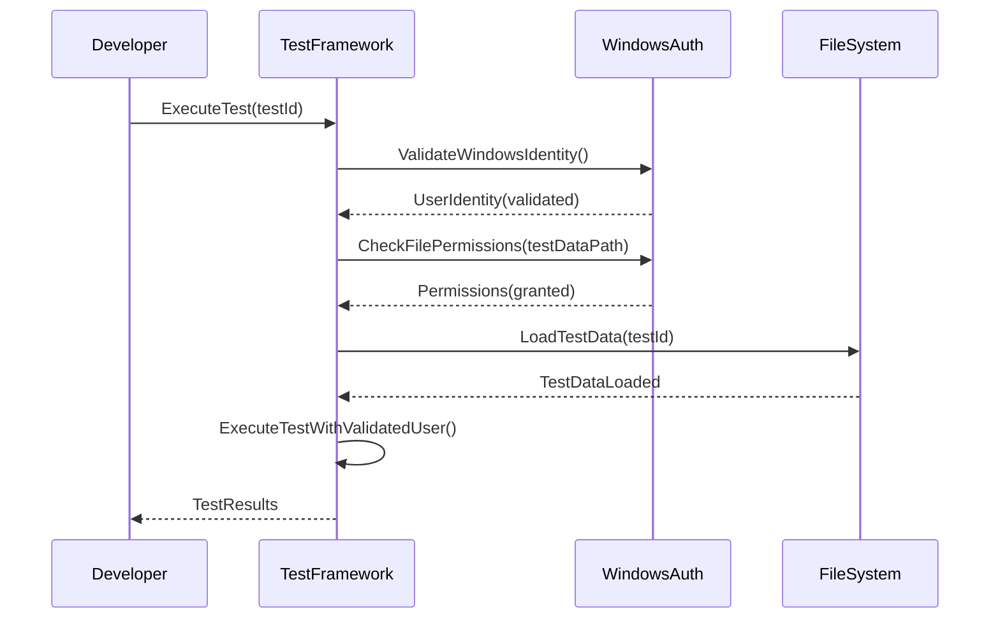

# Backend Architecture

The backend architecture focuses on the traditional server-based approach since this is a Windows Service testing framework that integrates directly with the existing service architecture rather than using serverless patterns.

### Service Architecture

#### Controller/Route Organization

The testing framework uses a controller-based architecture for organizing test execution and management functionality:

**Test Execution Controllers:**
```
LicenseReleaseService.Tests/
├── Controllers/
│   ├── TestExecutionController.cs
│   ├── TestConfigurationController.cs
│   ├── MockServiceController.cs
│   ├── PerformanceTestController.cs
│   └── ReportingController.cs
```

**Controller Template:**
```csharp
public class TestExecutionController : ITestExecutionController
{
    private readonly ITestExecutionEngine _executionEngine;
    private readonly ITestDataProvider _dataProvider;
    private readonly ILogger<TestExecutionController> _logger;

    public async Task<TestExecutionResult> ExecuteTestAsync(string testId)
    {
        var test = await _dataProvider.GetTestAsync(testId);
        return await _executionEngine.ExecuteTestAsync(test);
    }

    public async Task<TestSuiteResult> ExecuteTestSuiteAsync(string suiteId)
    {
        var suite = await _dataProvider.GetTestSuiteAsync(suiteId);
        return await _executionEngine.ExecuteTestSuiteAsync(suite);
    }
}
```

#### Controller Template

**Base Test Controller Template:**
```csharp
public abstract class BaseTestController
{
    protected readonly ILogger _logger;
    protected readonly ITestConfiguration _config;
    protected readonly ITestMetrics _metrics;

    protected BaseTestController(
        ILogger logger,
        ITestConfiguration config,
        ITestMetrics metrics)
    {
        _logger = logger ?? throw new ArgumentNullException(nameof(logger));
        _config = config ?? throw new ArgumentNullException(nameof(config));
        _metrics = metrics ?? throw new ArgumentNullException(nameof(metrics));
    }

    protected async Task<T> ExecuteWithMetricsAsync<T>(
        string operationName,
        Func<Task<T>> operation)
    {
        var stopwatch = Stopwatch.StartNew();
        try
        {
            _logger.LogDebug("Starting operation: {OperationName}", operationName);
            var result = await operation();
            stopwatch.Stop();
            _metrics.RecordOperation(operationName, stopwatch.ElapsedMilliseconds, true);
            _logger.LogDebug("Completed operation: {OperationName} in {Duration}ms",
                operationName, stopwatch.ElapsedMilliseconds);
            return result;
        }
        catch (Exception ex)
        {
            stopwatch.Stop();
            _metrics.RecordOperation(operationName, stopwatch.ElapsedMilliseconds, false);
            _logger.LogError(ex, "Operation failed: {OperationName} after {Duration}ms",
                operationName, stopwatch.ElapsedMilliseconds);
            throw;
        }
    }
}
```

### Database Architecture

#### Schema Design

The testing framework uses file-based "database" architecture consistent with the existing service:

**File-Based Schema Design:**
```csharp
public class TestDatabaseSchema
{
    // Test scenarios storage
    public class TestScenarioTable
    {
        public string ScenarioId { get; set; }
        public string Name { get; set; }
        public string Description { get; set; }
        public string ScenarioData { get; set; } // JSON content
        public DateTime CreatedAt { get; set; }
        public DateTime UpdatedAt { get; set; }
    }

    // Test results storage
    public class TestResultTable
    {
        public string ExecutionId { get; set; }
        public string TestId { get; set; }
        public string Outcome { get; set; }
        public string ResultData { get; set; } // JSON content
        public DateTime ExecutedAt { get; set; }
        public long DurationMs { get; set; }
    }

    // Performance benchmarks storage
    public class BenchmarkTable
    {
        public string BenchmarkId { get; set; }
        public string Operation { get; set; }
        public string BaselineData { get; set; } // JSON content
        public string CurrentData { get; set; } // JSON content
        public DateTime LastUpdated { get; set; }
    }
}
```

#### Data Access Layer

**Repository Pattern Implementation:**
```csharp
public interface ITestRepository<T> where T : class
{
    Task<T> GetByIdAsync(string id);
    Task<IEnumerable<T>> GetAllAsync();
    Task<T> AddAsync(T entity);
    Task<T> UpdateAsync(T entity);
    Task<bool> DeleteAsync(string id);
}

public class FileBasedTestRepository<T> : ITestRepository<T> where T : class
{
    private readonly string _dataPath;
    private readonly ILogger<FileBasedTestRepository<T>> _logger;
    private readonly IJsonSerializer _serializer;

    public FileBasedTestRepository(
        string dataPath,
        ILogger<FileBasedTestRepository<T>> logger,
        IJsonSerializer serializer)
    {
        _dataPath = dataPath ?? throw new ArgumentNullException(nameof(dataPath));
        _logger = logger ?? throw new ArgumentNullException(nameof(logger));
        _serializer = serializer ?? throw new ArgumentNullException(nameof(serializer));

        Directory.CreateDirectory(_dataPath);
    }

    public async Task<T> GetByIdAsync(string id)
    {
        var filePath = Path.Combine(_dataPath, $"{id}.json");
        if (!File.Exists(filePath))
        {
            _logger.LogWarning("Entity not found: {Id}", id);
            return null;
        }

        var json = await File.ReadAllTextAsync(filePath);
        return _serializer.Deserialize<T>(json);
    }

    public async Task<T> AddAsync(T entity)
    {
        var id = GetEntityId(entity);
        var filePath = Path.Combine(_dataPath, $"{id}.json");
        var json = _serializer.Serialize(entity, new JsonSerializerOptions { WriteIndented = true });
        await File.WriteAllTextAsync(filePath, json);

        _logger.LogInformation("Entity created: {Id}", id);
        return entity;
    }

    private string GetEntityId(T entity)
    {
        // Use reflection to get Id property
        var property = typeof(T).GetProperty("Id") ??
                      typeof(T).GetProperty($"{typeof(T).Name}Id");
        return property?.GetValue(entity)?.ToString() ??
               Guid.NewGuid().ToString();
    }
}
```

### Authentication and Authorization

#### Auth Flow

The testing framework uses Windows authentication for local development and CI/CD integration:



#### Middleware/Guards

**Authentication Guard Implementation:**
```csharp
public class TestExecutionGuard
{
    private readonly ILogger<TestExecutionGuard> _logger;
    private readonly IWindowsIdentityService _identityService;

    public TestExecutionGuard(
        ILogger<TestExecutionGuard> logger,
        IWindowsIdentityService identityService)
    {
        _logger = logger ?? throw new ArgumentNullException(nameof(logger));
        _identityService = identityService ?? throw new ArgumentNullException(nameof(identityService));
    }

    public async Task<bool> CanExecuteTestAsync(string testId, WindowsIdentity identity)
    {
        // Validate Windows identity
        if (!await _identityService.IsValidIdentityAsync(identity))
        {
            _logger.LogWarning("Invalid Windows identity for test execution: {TestId}", testId);
            return false;
        }

        // Check file system permissions
        if (!await HasRequiredPermissionsAsync(identity))
        {
            _logger.LogWarning("Insufficient permissions for test execution: {TestId}", testId);
            return false;
        }

        // Validate test access
        if (!await CanAccessTestAsync(testId, identity))
        {
            _logger.LogWarning("No access to test: {TestId}", testId);
            return false;
        }

        return true;
    }

    private async Task<bool> HasRequiredPermissionsAsync(WindowsIdentity identity)
    {
        // Check read/write access to test data directories
        var testDataPath = Path.Combine(AppDomain.CurrentDomain.BaseDirectory, "TestData");
        return await HasDirectoryAccessAsync(identity, testDataPath, FileSystemRights.Read | FileSystemRights.Write);
    }

    private async Task<bool> HasDirectoryAccessAsync(WindowsIdentity identity, string path, FileSystemRights rights)
    {
        try
        {
            var fileInfo = new DirectoryInfo(path);
            var accessControl = fileInfo.GetAccessControl();
            var rules = accessControl.GetAccessRules(true, true, typeof(NTAccount));

            return rules.Cast<FileSystemAccessRule>()
                .Any(rule => identity.User.Equals(rule.IdentityReference) &&
                           (rights & rule.FileSystemRights) == rights &&
                           rule.AccessControlType == AccessControlType.Allow);
        }
        catch (Exception ex)
        {
            _logger.LogError(ex, "Error checking directory permissions: {Path}", path);
            return false;
        }
    }
}
```

