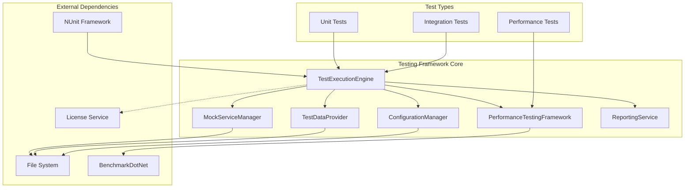
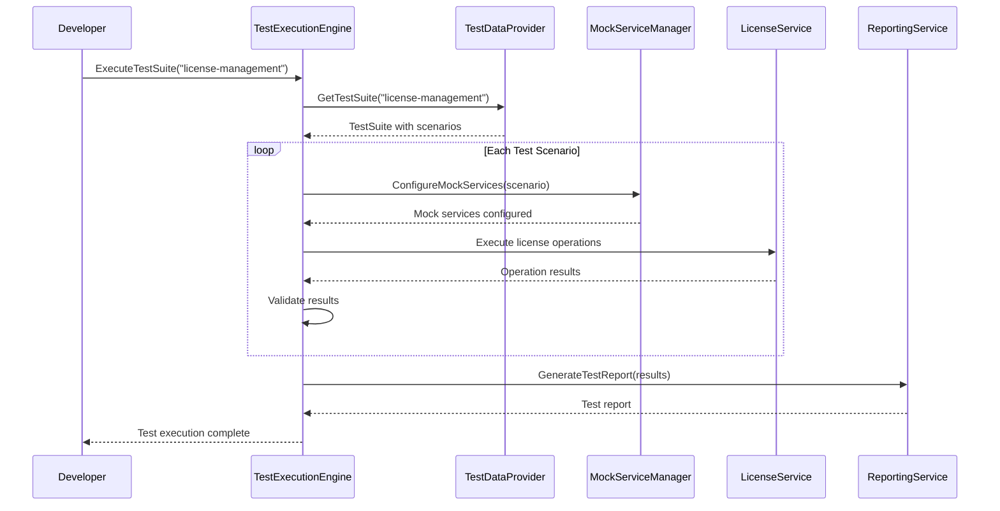

# Components

Based on the architectural patterns, tech stack, data models, and API specifications from above, I'll identify the major logical components across the testing framework architecture.

### TestExecutionEngine

**Responsibility:** Core component responsible for orchestrating test execution, managing test lifecycles, and coordinating between different test types (unit, integration, performance).

**Key Interfaces:**
- ITestExecutor - Main test execution orchestration interface
- ITestLifecycleManager - Test setup, execution, and cleanup management
- ITestResultCollector - Result collection and aggregation

**Dependencies:** TestDataProvider, MockServiceManager, ConfigurationProvider, LoggingService
**Technology Stack:** C# (.NET Framework 4.8), NUnit integration, Microsoft.Extensions.Logging

### MockServiceManager

**Responsibility:** Manages all mock services including license server mock, file system mock, and process execution mock. Provides realistic simulation of external dependencies without requiring actual services.

**Key Interfaces:**
- IMockServiceManager - Central mock service management
- IMockLicenseServer - SolidWorks License Manager simulation
- IMockFileSystem - File system operations simulation
- IMockProcessExecutor - Process execution simulation

**Dependencies:** TestDataProvider, ConfigurationProvider
**Technology Stack:** C# (.NET Framework 4.8), Moq framework, custom mock implementations

### TestDataProvider

**Responsibility:** Centralized management of all test data including test scenarios, configurations, mock responses, and performance benchmarks. Provides version-controlled access to test artifacts.

**Key Interfaces:**
- ITestDataProvider - Main test data access interface
- ILicenseScenarioProvider - License-specific test scenarios
- IConfigurationProvider - Test configuration management
- IBenchmarkProvider - Performance benchmark data

**Dependencies:** File System, Configuration Files
**Technology Stack:** C# (.NET Framework 4.8), JSON/XML serialization, file I/O

### ConfigurationManager

**Responsibility:** Manages test-specific configurations separate from production configurations. Handles test environment setup, configuration validation, and environment-specific settings.

**Key Interfaces:**
- ITestConfigurationManager - Test configuration management
- IEnvironmentManager - Test environment lifecycle
- IValidationService - Configuration validation

**Dependencies:** File System, TestDataProvider
**Technology Stack:** C# (.NET Framework 4.8), configuration file parsers, validation framework

### PerformanceTestingFramework

**Responsibility:** Specialized component for performance testing including benchmarking, load testing, and performance regression detection. Integrates with BenchmarkDotNet for reliable performance measurements.

**Key Interfaces:**
- IPerformanceTestExecutor - Performance test execution
- IBenchmarkRunner - BenchmarkDotNet integration
- IPerformanceAnalyzer - Performance analysis and reporting
- ILoadTestCoordinator - Load testing orchestration

**Dependencies:** TestExecutionEngine, MockServiceManager, TestDataProvider
**Technology Stack:** C# (.NET Framework 4.8), BenchmarkDotNet, performance monitoring

### ReportingService

**Responsibility:** Generates comprehensive test reports including execution summaries, performance metrics, coverage reports, and trend analysis. Provides multiple output formats for different stakeholders.

**Key Interfaces:**
- ITestReporter - Test report generation
- IMetricsCollector - Test execution metrics
- ICoverageAnalyzer - Code coverage analysis
- ITrendAnalyzer - Performance and quality trend analysis

**Dependencies:** TestExecutionEngine, PerformanceTestingFramework, File System
**Technology Stack:** C# (.NET Framework 4.8), report generation libraries, charting/visualization

### Component Diagrams


