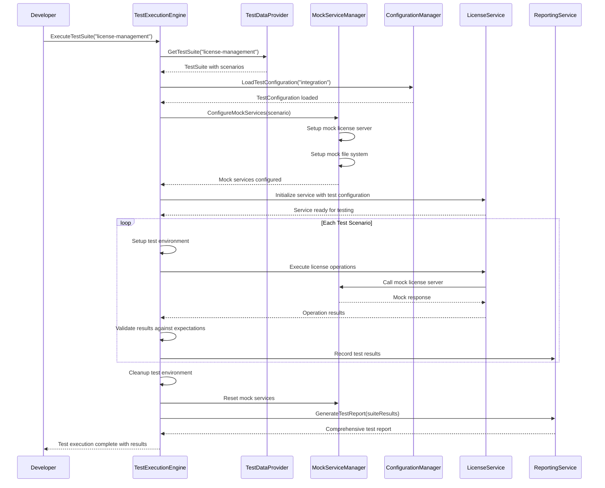
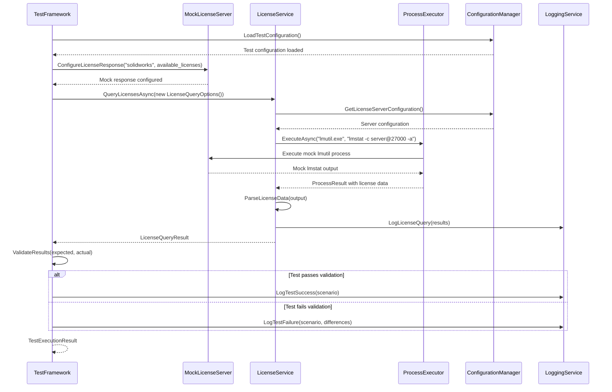
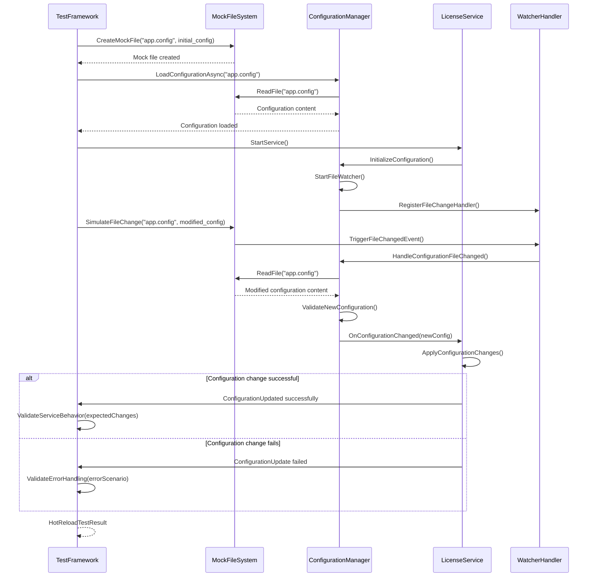
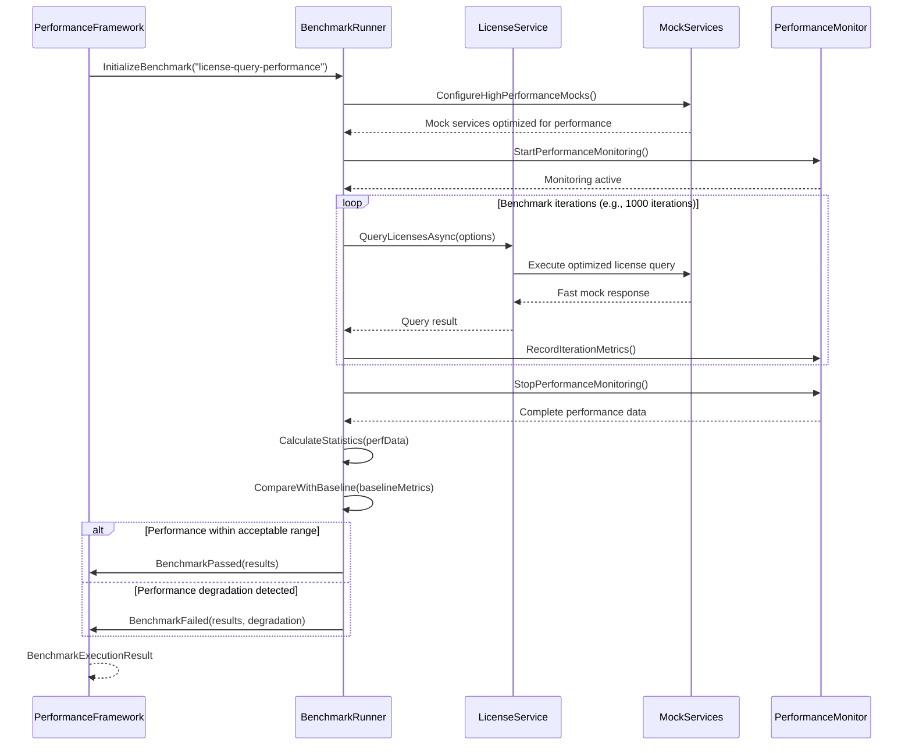
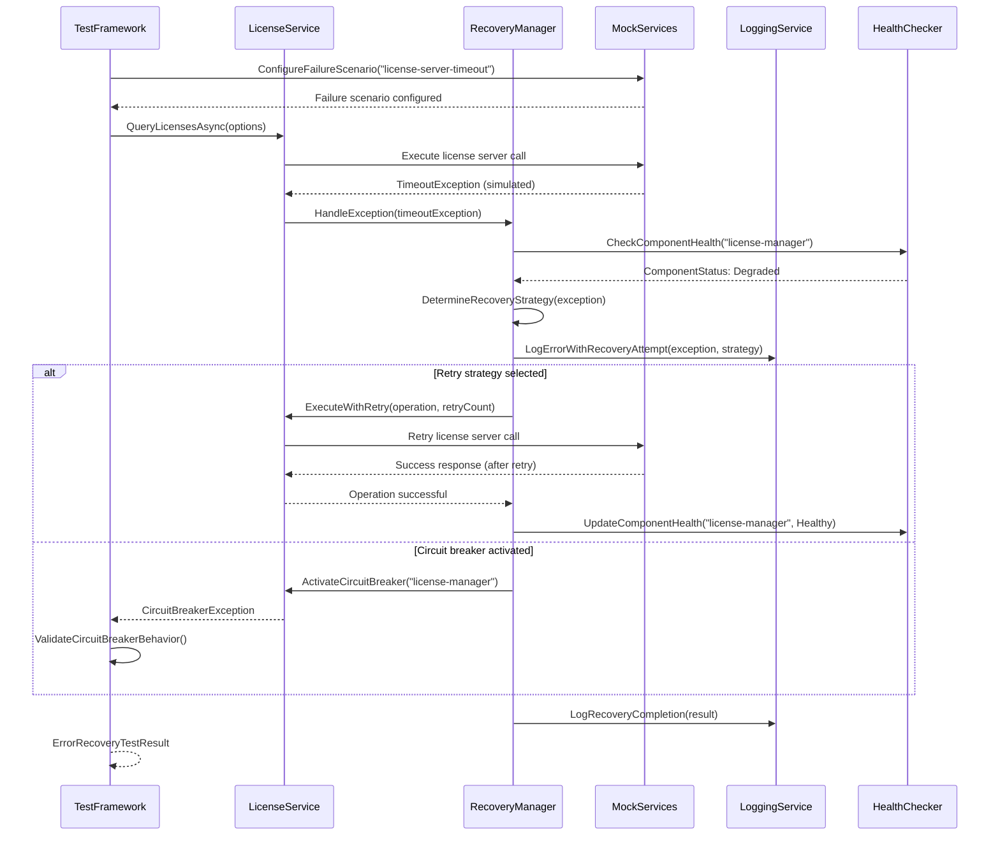

# Core Workflows

These sequence diagrams illustrate the key system workflows for the testing framework, showing component interactions including external API integration, test execution flows, and error handling paths.

### Test Execution Workflow

### License Management Test Workflow

### Configuration Hot-Reload Test Workflow

### Performance Benchmarking Workflow

### Error Recovery and Resilience Test Workflow


