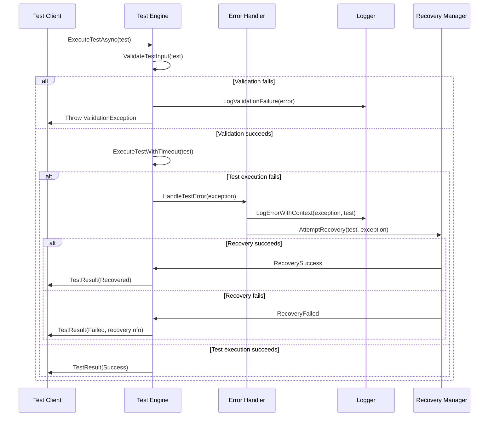

# Error Handling Strategy

### Error Flow



### Error Response Format

```typescript
interface ApiError {
  error: {
    code: string;
    message: string;
    details?: Record<string, any>;
    timestamp: string;
    requestId: string;
  };
}
```

### Frontend Error Handling

**Not applicable** - No frontend components in this backend-only architecture.

### Backend Error Handling

```csharp
public class TestExecutionErrorHandler
{
    private readonly ILogger<TestExecutionErrorHandler> _logger;
    private readonly IRecoveryManager _recoveryManager;
    private readonly INotificationService _notificationService;

    public async Task<TestExecutionResult> HandleTestErrorAsync(
        TestExecutionContext context,
        Exception exception)
    {
        var errorInfo = CreateErrorInfo(context, exception);

        // Log the error with full context
        _logger.LogError(exception,
            "Test execution failed: {TestId} - {ErrorType} - {Message}",
            context.TestId, exception.GetType().Name, exception.Message);

        // Attempt recovery if possible
        var recoveryResult = await _recoveryManager.AttemptRecoveryAsync(context, exception);

        // Create error response
        var testResult = new TestExecutionResult
        {
            TestId = context.TestId,
            ScenarioId = context.ScenarioId,
            Outcome = recoveryResult.Success ? TestOutcome.Recovered : TestOutcome.Failed,
            ErrorMessage = exception.Message,
            ErrorDetails = new ErrorDetails
            {
                ExceptionType = exception.GetType().Name,
                StackTrace = exception.StackTrace,
                RecoveryAttempts = recoveryResult.Attempts,
                RecoveryResult = recoveryResult.Message
            },
            ExecutionTime = DateTime.UtcNow,
            Metrics = context.Metrics
        };

        // Notify stakeholders if critical
        if (IsCriticalError(exception, context))
        {
            await _notificationService.NotifyTestFailureAsync(errorInfo);
        }

        return testResult;
    }

    private ErrorInfo CreateErrorInfo(TestExecutionContext context, Exception exception)
    {
        return new ErrorInfo
        {
            Code = MapExceptionToErrorCode(exception),
            Message = exception.Message,
            Details = new Dictionary<string, object>
            {
                ["TestId"] = context.TestId,
                ["ScenarioId"] = context.ScenarioId,
                ["TestType"] = context.TestType.ToString(),
                ["ExecutionEnvironment"] = context.Environment,
                ["Timestamp"] = DateTime.UtcNow,
                ["RequestId"] = context.RequestId
            },
            Timestamp = DateTime.UtcNow,
            RequestId = context.RequestId
        };
    }

    private string MapExceptionToErrorCode(Exception exception)
    {
        return exception switch
        {
            ValidationException => "VALIDATION_ERROR",
            TimeoutException => "TIMEOUT_ERROR",
            LicenseQueryException => "LICENSE_QUERY_ERROR",
            ConfigurationException => "CONFIGURATION_ERROR",
            ProcessExecutionException => "PROCESS_EXECUTION_ERROR",
            FileSystemException => "FILE_SYSTEM_ERROR",
            _ => "UNKNOWN_ERROR"
        };
    }

    private bool IsCriticalError(Exception exception, TestExecutionContext context)
    {
        return exception is TimeoutException ||
               exception is ProcessExecutionException ||
               context.TestType == TestType.Integration ||
               context.Environment == Environment.Production;
    }
}

public class RecoveryManager
{
    private readonly ILogger<RecoveryManager> _logger;
    private readonly ITestExecutionEngine _executionEngine;
    private readonly IHealthChecker _healthChecker;

    public async Task<RecoveryResult> AttemptRecoveryAsync(
        TestExecutionContext context,
        Exception exception)
    {
        var attempts = 0;
        var maxAttempts = 3;

        while (attempts < maxAttempts)
        {
            attempts++;

            _logger.LogInformation("Recovery attempt {Attempt}/{MaxAttempts} for test {TestId}",
                attempts, maxAttempts, context.TestId);

            try
            {
                // Check system health before retry
                var healthCheck = await _healthChecker.GetHealthReportAsync();
                if (healthCheck.OverallStatus != HealthStatus.Healthy)
                {
                    _logger.LogWarning("System health check failed, skipping recovery attempt");
                    break;
                }

                // Wait before retry with exponential backoff
                var delay = TimeSpan.FromSeconds(Math.Pow(2, attempts - 1));
                await Task.Delay(delay);

                // Retry the test execution
                var retryResult = await _executionEngine.ExecuteTestAsync(context.Test);

                if (retryResult.Outcome == TestOutcome.Passed)
                {
                    _logger.LogInformation("Recovery successful for test {TestId} after {Attempts} attempts",
                        context.TestId, attempts);

                    return new RecoveryResult
                    {
                        Success = true,
                        Message = $"Recovery successful after {attempts} attempts",
                        Attempts = attempts,
                        FinalResult = retryResult
                    };
                }
            }
            catch (Exception retryException)
            {
                _logger.LogWarning(retryException,
                    "Recovery attempt {Attempt} failed for test {TestId}", attempts, context.TestId);

                // Check if this is a non-retryable exception
                if (IsNonRetryableException(retryException))
                {
                    break;
                }
            }
        }

        return new RecoveryResult
        {
            Success = false,
            Message = $"Recovery failed after {attempts} attempts",
            Attempts = attempts,
            FinalException = exception
        };
    }

    private bool IsNonRetryableException(Exception exception)
    {
        return exception is ValidationException ||
               exception is ConfigurationException ||
               exception is FileNotFoundException ||
               exception is UnauthorizedAccessException;
    }
}
```

