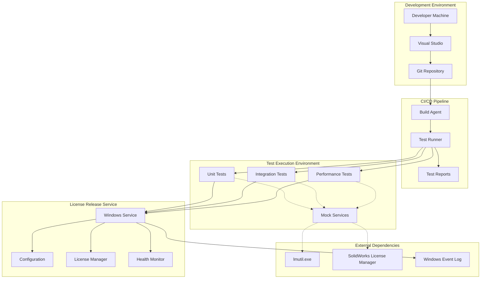

# High Level Architecture

### Technical Summary

This architecture implements a comprehensive testing framework for an existing sophisticated Windows Service application that manages SolidWorks network licenses. The solution employs a backend-focused testing approach using MSTest and xUnit for unit testing, Moq for mocking, and modern performance testing capabilities, all built on .NET 9.0 to leverage modern framework capabilities. The architecture integrates seamlessly with the existing service through dependency injection and interface-based design, enabling comprehensive testing of license management, configuration hot-reload, process execution, and health monitoring systems without modifying production functionality. Key integration points include mock license server environments, test-specific Windows Service hosts, and CI/CD pipeline integration for automated quality assurance.

### Platform and Infrastructure Choice

Based on the PRD requirements for Windows Service compatibility and existing .NET 9.0 architecture, I recommend the following platform approach:

**Option 1: Windows-Native Testing Environment (Recommended)**
- **Pros:** Native compatibility with existing Windows Service architecture, direct access to Windows Event Log and registry, seamless integration with Visual Studio and MSBuild, modern testing frameworks with .NET 9.0 support
- **Cons:** Windows-only deployment, requires Windows development environment
- **Best for:** Maximum compatibility with existing sophisticated service architecture

**Option 2: Containerized Testing Environment**
- **Pros:** Consistent testing environments, potential for CI/CD pipeline isolation, easier test data management
- **Cons:** Windows Container complexity, additional infrastructure overhead, potential compatibility issues with Windows Service lifecycle testing
- **Best for:** Organizations with existing container expertise and infrastructure

**Option 3: Cloud-Based Testing Platform**
- **Pros:** Scalable test execution, managed infrastructure, advanced test reporting capabilities
- **Cons:** Significant architectural changes required, potential Windows Service compatibility issues, higher complexity
- **Best for:** Future consideration if migrating service architecture

**Selected Platform:** Windows-Native Testing Environment

**Platform:** Windows Server 2019+ with .NET 9.0
**Key Services:** Visual Studio Test Platform, MSBuild, Windows Event Log, File System
**Deployment Host and Regions:** On-premises Windows servers or Azure Windows VMs in same regions as existing service

### Repository Structure

**Structure:** Monorepo with solution-based organization
**Monorepo Tool:** MSBuild Solution with Project References
**Package Organization:**
- Main solution contains production service and all test projects
- Test projects organized by type (Unit, Integration, Performance)
- Shared test infrastructure in separate projects
- Test data and configurations in dedicated folders

### High Level Architecture Diagram

### Architectural Patterns

- **Test Pyramid Architecture:** Unit tests at the base, integration tests in the middle, performance tests at the top - Rationale: Provides comprehensive coverage while maintaining fast feedback loops and managing test execution costs

- **Dependency Injection Pattern:** Constructor injection for all test dependencies - Rationale: Enables clean mocking, isolates components under test, and maintains consistency with existing service architecture

- **Mock-Based Testing Pattern:** Interface-based mocking for all external dependencies - Rationale: Enables isolated unit testing without requiring actual external systems like SolidWorks License Manager

- **Test Data Builder Pattern:** Builder pattern for creating test data and scenarios - Rationale: Provides readable, maintainable test data creation and reduces test code duplication

- **Arrange-Act-Assert Pattern:** Standard test structure for all test methods - Rationale: Provides consistent, readable test organization and clear test intent

- **Test Fixture Pattern:** Reusable test setup and teardown for common test scenarios - Rationale: Reduces test code duplication and ensures consistent test environments

- **Performance Benchmarking Pattern:** BenchmarkDotNet for performance testing - Rationale: Provides reliable, consistent performance measurements with proper warmup and statistical analysis

- **Configuration-Driven Testing Pattern:** Test configurations externalized from test code - Rationale: Enables testing across different scenarios without code changes and supports environment-specific testing

